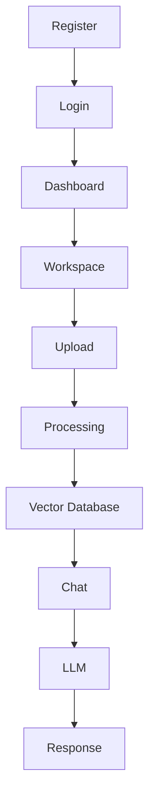

# 01 - Project Overview

> Version: 1.0.0  
> Project Name: AI Document Assistant  
> Architecture: Full Stack + AI + Retrieval-Augmented Generation (RAG)

---

# Table of Contents

1. Introduction
2. Vision
3. Mission
4. Problem Statement
5. Proposed Solution
6. Objectives
7. Scope
8. Target Users
9. User Personas
10. Core Features
11. Functional Requirements
12. Non-Functional Requirements
13. User Journey
14. Business Workflow
15. Use Cases
16. Success Metrics
17. Assumptions
18. Constraints
19. Risks
20. Future Scope

---

# 1. Introduction

AI Document Assistant is a modern AI-powered platform that allows users to upload documents and interact with them using natural language.

Instead of manually searching hundreds of pages, users simply ask questions such as:

> What is the leave policy?

or

> Summarize this contract.

The application retrieves the relevant sections from uploaded documents using semantic search and then generates accurate responses using a Large Language Model (LLM).

This architecture is known as **Retrieval-Augmented Generation (RAG)**.

---

# 2. Vision

To build an intelligent document assistant that enables organizations and individuals to retrieve information from their private knowledge base quickly, accurately, and securely.

The platform should become the "ChatGPT for Personal Documents."

---

# 3. Mission

Our mission is to reduce the time spent searching documents by over 90% through AI-powered semantic search and intelligent question answering.

---

# 4. Problem Statement

Organizations manage thousands of documents, including:

- Policies
- Contracts
- SOPs
- Research Papers
- Medical Records
- Financial Statements
- User Manuals

Employees waste significant time searching for information manually.

Traditional keyword search has limitations:

- Exact keyword matching
- No understanding of context
- Poor handling of synonyms
- Cannot summarize information
- Cannot answer natural language questions

LLMs alone cannot solve this because they do not know the contents of private documents.

---

# 5. Proposed Solution

The application combines:

- Document Processing
- Vector Embeddings
- Semantic Search
- Large Language Models
- Retrieval-Augmented Generation

Workflow:

```text
Upload Document
        ↓
Extract Text
        ↓
Generate Embeddings
        ↓
Store in Vector Database
        ↓
User Asks Question
        ↓
Retrieve Relevant Chunks
        ↓
LLM Generates Answer
        ↓
Answer with Citations
```

---

# 6. Objectives

## Primary Objectives

- Upload documents
- Extract text
- Build searchable knowledge base
- Enable conversational search
- Return accurate answers
- Show citations
- Support multiple document formats

## Secondary Objectives

- AI summaries
- Document comparison
- OCR support
- Team collaboration
- Role-based access
- Cloud deployment

---

# 7. Project Scope

## Included

- Authentication
- Workspace management
- Document upload
- PDF parsing
- DOCX parsing
- Excel parsing
- OCR
- Embeddings
- ChromaDB
- AI Chat
- Citations
- Chat History
- Dashboard
- Docker Deployment

## Excluded (Phase 1)

- Mobile Application
- Video Processing
- Audio Processing
- Enterprise SSO
- Multi-language Translation
- Fine-tuning LLMs

---

# 8. Target Users

### Individual Users

Store personal documents and chat with them.

Examples:

- Insurance Policies
- Notes
- Books
- Certificates

---

### Students

Upload:

- Lecture Notes
- Research Papers
- Assignments

Questions:

- Summarize Chapter 3
- Explain Page 25
- Create Quiz

---

### Companies

Internal Knowledge Base

Documents:

- SOPs
- HR Policies
- Employee Handbook
- Technical Documentation

---

### Legal Firms

Upload

- Agreements
- Contracts
- Case Files

---

### Healthcare

Upload

- Clinical Guidelines
- Research Papers
- Hospital SOPs

---

# 9. User Personas

## Persona 1

### HR Manager

Goals:

- Search employee policies
- Find leave rules
- Generate policy summaries

Pain Points:

- Large PDFs
- Manual searching

---

## Persona 2

### Software Developer

Goals:

- Search API documentation
- Understand architecture
- Find coding guidelines

---

## Persona 3

### Student

Goals:

- Summarize books
- Ask questions
- Prepare for exams

---

## Persona 4

### Lawyer

Goals:

- Search contracts
- Compare agreements
- Identify clauses

---

# 10. Core Features

## Authentication

- Register
- Login
- Forgot Password
- JWT
- Refresh Token

---

## Workspace

Users create multiple workspaces.

Example:

HR

Finance

Research

Personal

---

## Document Library

Features

- Upload
- Delete
- Rename
- Preview
- Download

---

## AI Chat

Features

- Question Answering
- Summarization
- Citation
- Follow-up Questions

---

## Search

- Semantic Search
- Keyword Search
- Metadata Search

---

## Dashboard

Displays

- Total Documents
- Storage Usage
- Recent Chats
- Recent Uploads

---

# 11. Functional Requirements

FR-001

Users shall register.

---

FR-002

Users shall login securely.

---

FR-003

Users shall upload documents.

---

FR-004

System shall parse uploaded files.

---

FR-005

System shall generate embeddings.

---

FR-006

System shall store embeddings.

---

FR-007

Users shall ask questions.

---

FR-008

System shall retrieve relevant chunks.

---

FR-009

LLM shall answer using retrieved context.

---

FR-010

Responses shall contain citations.

---

FR-011

System shall save chat history.

---

FR-012

Users shall manage workspaces.

---

# 12. Non-Functional Requirements

## Performance

- Upload < 10 sec
- Query < 3 sec
- Embedding < 30 sec

---

## Scalability

Support

- 10,000 Documents
- Millions of Chunks
- Multiple Users

---

## Security

- JWT
- Password Hashing
- HTTPS
- Role-based Access

---

## Reliability

- Daily Backups
- Error Logging
- Automatic Recovery

---

## Maintainability

- Modular Architecture
- Clean Code
- Feature-based Structure

---

# 13. User Journey

```text
Register
      ↓
Login
      ↓
Dashboard
      ↓
Create Workspace
      ↓
Upload Documents
      ↓
Processing
      ↓
Embeddings Generated
      ↓
Chat with Documents
      ↓
Receive AI Response
      ↓
View Sources
```

---

# 14. Business Workflow



---

# 15. Primary Use Cases

### UC-01

Register

Actor:

User

---

### UC-02

Upload Document

Actor:

Authenticated User

---

### UC-03

Chat with Documents

Actor:

Authenticated User

---

### UC-04

Search Documents

Actor:

Authenticated User

---

### UC-05

Delete Document

Actor:

Authenticated User

---

### UC-06

View Sources

Actor:

Authenticated User

---

# 16. Success Metrics

Average Query Time

< 3 Seconds

---

Answer Accuracy

> 90%

---

Citation Accuracy

> 95%

---

User Satisfaction

> 4.5/5

---

Average Upload Time

< 15 Seconds

---

# 17. Assumptions

- Users have internet access.
- Uploaded documents are valid.
- LLM is available.
- Vector database is healthy.
- Storage is available.

---

# 18. Constraints

- Local LLM performance depends on hardware.
- OCR quality depends on scan quality.
- Large PDFs require more processing time.
- Embedding generation is CPU/GPU intensive.

---

# 19. Risks

| Risk | Impact | Mitigation |
|------|--------|------------|
| Poor OCR | Medium | Use EasyOCR/Tesseract fallback |
| Hallucinations | High | Strict RAG with citations |
| Large PDFs | Medium | Background processing |
| Storage Growth | Medium | Compression and cloud storage |
| Slow Search | Low | Efficient chunking and indexing |

---

# 20. Future Scope

## AI Features

- Voice Assistant
- Image Understanding
- AI Report Generation
- AI Agents
- Multi-modal Search

## Collaboration

- Shared Workspaces
- Team Roles
- Comments
- Version Control

## Enterprise

- SSO
- LDAP
- Azure AD
- Audit Logs
- API Gateway

---

# Conclusion

The AI Document Assistant aims to provide an intelligent, scalable, and secure platform for interacting with private documents using Retrieval-Augmented Generation (RAG). By combining semantic search with modern LLMs, the system enables users to retrieve precise, explainable, and context-aware answers while maintaining a modular architecture that can evolve into an enterprise-grade knowledge platform.