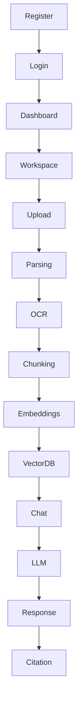
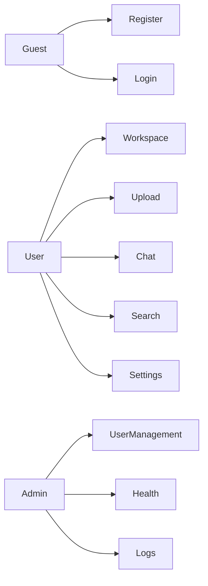

# Software Requirements Specification (SRS)

**Project:** AI Document Assistant

**Version:** 1.0

**Document Version:** 1.0

**Prepared By:** Your Name

**Date:** July 2026

---

# Table of Contents

1. Introduction
2. Overall Description
3. Product Perspective
4. Product Features
5. User Classes
6. Operating Environment
7. Design Constraints
8. Assumptions
9. Dependencies
10. System Architecture
11. Functional Requirements (Part 2)
12. Non-Functional Requirements (Part 3)
13. Use Cases (Part 4)
14. Appendix

---

# 1. Introduction

## 1.1 Purpose

This document specifies the functional and non-functional requirements for the AI Document Assistant.

It serves as the official blueprint for developers, testers, designers, project managers, and stakeholders during development.

The application enables users to upload documents and interact with them using Artificial Intelligence powered by Retrieval-Augmented Generation (RAG).

---

## 1.2 Intended Audience

This document is intended for

- Software Developers
- Backend Engineers
- Frontend Engineers
- AI Engineers
- QA Engineers
- UI/UX Designers
- DevOps Engineers
- Product Owners

---

## 1.3 Scope

The system provides an intelligent document management platform where users can

- Upload documents
- Organize workspaces
- Generate embeddings
- Perform semantic search
- Chat with documents
- Receive AI-generated answers
- View source citations
- Manage chat history

The platform supports multiple document formats including

- PDF
- DOCX
- XLSX
- PPTX
- TXT
- Images

---

## 1.4 Goals

The primary goals of the project are

- Reduce document search time
- Improve information accessibility
- Eliminate manual searching
- Enable conversational AI
- Support enterprise knowledge management

---

# 2. Definitions

| Term | Meaning |
|--------|----------|
| AI | Artificial Intelligence |
| LLM | Large Language Model |
| RAG | Retrieval Augmented Generation |
| Embedding | Vector representation of text |
| Chunk | Small section of a document |
| Vector DB | Database storing embeddings |
| Semantic Search | Meaning-based search |
| Workspace | Collection of documents |
| Citation | Source paragraph used to answer |

---

# 3. Overall Description

The AI Document Assistant consists of several interconnected modules.

```text
Frontend

↓

Authentication

↓

Backend API

↓

Document Processing

↓

Embeddings

↓

Vector Database

↓

Retriever

↓

LLM

↓

Response Generator
```

---

# 4. Product Perspective

The application follows a modular microservice-inspired architecture.

Major components include

- Frontend
- Backend API
- Authentication
- Document Processor
- AI Service
- RAG Engine
- Vector Database
- Relational Database
- File Storage

Each component can evolve independently.

---

# 5. Product Features

## Authentication

Features

- User Registration
- Login
- Logout
- Refresh Token
- Password Reset
- Email Verification

---

## Workspace Management

Users can create multiple workspaces.

Examples

- HR

- Finance

- Research

- Legal

Each workspace maintains an independent knowledge base.

---

## Document Management

Supported Operations

- Upload
- Delete
- Rename
- Download
- Preview
- Search

Supported Formats

- PDF

- DOCX

- PPTX

- XLSX

- TXT

- PNG

- JPG

---

## AI Features

- Chat with documents

- AI Summary

- Semantic Search

- Citation Support

- Multi-document Search

- Follow-up Questions

---

## Search

Supports

Keyword Search

Semantic Search

Metadata Search

---

# 6. User Classes

## Guest

Permissions

- Register

- Login

---

## Registered User

Permissions

- Upload documents

- Create workspaces

- Chat with AI

- Delete documents

- Download files

---

## Administrator

Permissions

- Manage users

- Manage workspaces

- Monitor usage

- Delete inappropriate content

---

# 7. Operating Environment

## Client

Operating Systems

- Windows

- Linux

- macOS

Browsers

- Chrome

- Firefox

- Edge

- Safari

---

## Server

Ubuntu Linux

Docker

Python

FastAPI

---

## Database

PostgreSQL

ChromaDB

---

## AI Runtime

Ollama

Supported Models

- Qwen

- Llama

- Gemma

---

# 8. Design Constraints

The following constraints apply.

## Technology

Frontend

React

TypeScript

Tailwind

Backend

FastAPI

Database

PostgreSQL

Vector Database

ChromaDB

---

## Performance

Maximum Upload Size

200 MB

Maximum Query Time

3 seconds

Maximum Concurrent Users

500

---

## Security

JWT Authentication

HTTPS

Encrypted Passwords

Role-based Authorization

---

# 9. Assumptions

The following assumptions are made.

- User has internet connectivity.
- Documents are readable.
- AI model is available.
- Database is operational.
- Storage capacity is sufficient.
- Users possess valid credentials.

---

# 10. Dependencies

External Dependencies

- FastAPI

- SQLAlchemy

- PostgreSQL

- LangChain

- ChromaDB

- Ollama

- PyMuPDF

- EasyOCR

- Tesseract

- Docker

---

# 11. High-Level Architecture

```mermaid
flowchart TD

User

↓

Frontend

↓

REST API

↓

Authentication

↓

Backend

↓

Document Service

↓

Embedding Service

↓

Vector Database

↓

Retriever

↓

Prompt Builder

↓

LLM

↓

Answer

```

---

# 12. Product Workflow

```text

User Login

↓

Dashboard

↓

Workspace

↓

Upload Document

↓

Store File

↓

Extract Text

↓

Chunk Text

↓

Generate Embeddings

↓

Store Vectors

↓

Ask Question

↓

Retrieve Chunks

↓

Generate Prompt

↓

LLM

↓

Answer

↓

Show Citation

```

---

# 13. External Interfaces

## User Interface

Responsive Web Application

Dark Theme

Light Theme

---

## REST API

JSON

HTTPS

JWT

---

## Database Interface

SQLAlchemy ORM

PostgreSQL

---

## AI Interface

LangChain

Ollama

REST

---

## Storage Interface

Local Storage

AWS S3 (Future)

---

# 14. Data Flow

```text

PDF

↓

Parser

↓

Cleaner

↓

Chunker

↓

Embedding Generator

↓

Vector Database

↓

Retriever

↓

Prompt

↓

LLM

↓

Answer

```

---

# 15. Security Overview

Authentication

JWT Access Token

Refresh Token

Password Hashing

Authorization

Workspace Ownership

API Validation

Input Validation

Rate Limiting

CORS

HTTPS

Audit Logging

---

# 16. Error Handling

Common Errors

401 Unauthorized

403 Forbidden

404 Not Found

422 Validation Error

500 Internal Server Error

503 AI Service Unavailable

---

# 17. Logging

Application Logs

Authentication Logs

AI Logs

API Logs

System Logs

Document Processing Logs

---

# 18. Monitoring

Health Endpoint

Database Health

Vector Database Health

LLM Health

Storage Health

---

# 19. Backup Strategy

Database Backup

Daily

Storage Backup

Weekly

Configuration Backup

Monthly

---

# 20. Future Compatibility

The architecture supports future integration with

Azure OpenAI

OpenAI

Anthropic

Google Gemini

Qdrant

Pinecone

Redis

Kubernetes

AWS

Azure

Google Cloud

---

# End of Part 1

---

# 21. Functional Requirements

## Overview

Functional requirements describe the behavior of the system.

Each requirement has:

- Requirement ID
- Description
- Priority
- Actor
- Preconditions
- Postconditions

Priority Levels

| Priority | Meaning |
|-----------|---------|
| High | Mandatory |
| Medium | Recommended |
| Low | Optional |

---

# Module 1 — Authentication

---

## FR-001 User Registration

### Description

The system shall allow a new user to create an account.

Priority

High

Actor

Guest

Input

- Name
- Email
- Password

Output

Account Created

Preconditions

Email must not exist.

Postconditions

User account is created.

---

## FR-002 Email Verification

Description

The system shall verify email ownership.

Priority

High

---

## FR-003 User Login

Description

The system shall authenticate users using email and password.

Priority

High

Output

- Access Token
- Refresh Token

---

## FR-004 Logout

Description

The system shall invalidate refresh tokens.

---

## FR-005 Refresh Access Token

Description

Generate new JWT using refresh token.

---

## FR-006 Forgot Password

Description

User requests password reset.

---

## FR-007 Reset Password

Description

Allow password update using secure token.

---

## FR-008 Update Profile

Description

Users can update

- Name
- Profile Image
- Password

---

## FR-009 Delete Account

Description

Delete user account and associated resources.

---

# Module 2 — Workspace Management

---

## FR-010 Create Workspace

Users can create multiple workspaces.

Example

HR

Finance

Research

Legal

Personal

---

## FR-011 Rename Workspace

Users can rename workspaces.

---

## FR-012 Delete Workspace

Deleting workspace deletes

Documents

Embeddings

Chat History

Metadata

---

## FR-013 View Workspace

Display

Documents

Storage Used

Recent Chats

Statistics

---

## FR-014 Search Workspace

Search workspace by name.

---

# Module 3 — Document Management

---

## FR-015 Upload Document

Supported Formats

PDF

DOCX

TXT

PPTX

XLSX

PNG

JPEG

---

## FR-016 Validate File

Check

Extension

Size

Corruption

Virus Scan (Future)

---

## FR-017 Store Document

Store uploaded document securely.

---

## FR-018 Rename Document

---

## FR-019 Delete Document

Delete

Original File

Embeddings

Vectors

Metadata

---

## FR-020 Download Document

Allow users to download original file.

---

## FR-021 Preview Document

Preview PDF inside browser.

---

## FR-022 Document Metadata

Store

File Name

Author

Upload Date

File Size

Pages

Workspace

---

## FR-023 Document Versioning

Future feature.

---

# Module 4 — Document Processing

---

## FR-024 Parse PDF

Extract text using PyMuPDF.

---

## FR-025 Parse DOCX

Extract text from Word files.

---

## FR-026 Parse PPTX

Extract presentation text.

---

## FR-027 Parse Excel

Extract worksheets.

---

## FR-028 OCR

Extract text from scanned PDFs.

Technologies

EasyOCR

Tesseract

---

## FR-029 Text Cleaning

Remove

Extra Spaces

Blank Lines

Unsupported Characters

---

## FR-030 Language Detection

Automatically detect language.

Future

Translation

---

# Module 5 — Chunking

---

## FR-031 Chunk Document

Split text into chunks.

Chunk Size

500–1000 Characters

Overlap

100 Characters

---

## FR-032 Metadata Generation

Each chunk stores

Document ID

Page Number

Chunk Number

Workspace

Source

---

## FR-033 Chunk Validation

Ensure

No empty chunks

No duplicate chunks

---

# Module 6 — Embedding Generation

---

## FR-034 Generate Embeddings

Create vector embedding.

Model

BAAI BGE

---

## FR-035 Store Embeddings

Store vectors inside ChromaDB.

---

## FR-036 Update Embeddings

Rebuild vectors after document modification.

---

## FR-037 Delete Embeddings

Delete vectors when document removed.

---

# Module 7 — Vector Search

---

## FR-038 Semantic Search

Convert query into embedding.

---

## FR-039 Similarity Search

Retrieve Top-K chunks.

Default

Top 5

---

## FR-040 Re-ranking

Sort retrieved chunks.

Future Enhancement

---

# Module 8 — AI Chat

---

## FR-041 Ask Question

User enters question.

Example

"What is leave policy?"

---

## FR-042 Prompt Builder

Construct prompt using

Question

Retrieved Context

Instructions

---

## FR-043 Generate Response

Send prompt to LLM.

---

## FR-044 Response Streaming

Return answer token-by-token.

Future

WebSockets

---

## FR-045 Source Citation

Display

Page Number

Chunk

Document Name

---

## FR-046 Follow-up Questions

Maintain chat context.

---

## FR-047 Chat History

Save

Question

Answer

Timestamp

---

## FR-048 Delete Chat

Delete conversation.

---

# Module 9 — Search

---

## FR-049 Keyword Search

Traditional keyword search.

---

## FR-050 Semantic Search

Meaning-based search.

---

## FR-051 Filter Search

Filter by

Workspace

File Type

Date

Author

---

# Module 10 — Dashboard

---

## FR-052 Statistics

Display

Total Documents

Chats

Storage

Embeddings

---

## FR-053 Recent Documents

Show recent uploads.

---

## FR-054 Recent Chats

Display last conversations.

---

# Module 11 — Notifications

---

## FR-055 Upload Complete

Notify user.

---

## FR-056 Processing Failed

Notify processing errors.

---

## FR-057 Embedding Complete

Notify indexing completed.

---

# Module 12 — Administration

---

## FR-058 User Management

Admin can

Disable Users

Delete Users

Reset Password

---

## FR-059 Activity Logs

Track

Login

Uploads

Deletion

Chat

Errors

---

## FR-060 System Health

Expose

Health API

Database Status

LLM Status

Vector Database Status

Storage Status

---

# Functional Requirement Summary

| Module | Requirements |
|----------|-------------|
| Authentication | 9 |
| Workspace | 5 |
| Documents | 9 |
| Processing | 7 |
| Chunking | 3 |
| Embeddings | 4 |
| Search | 4 |
| AI Chat | 8 |
| Dashboard | 3 |
| Notifications | 3 |
| Administration | 3 |

Total Functional Requirements

---

# 22. Non-Functional Requirements

## Overview

Non-functional requirements define **how the system should behave**, rather than **what the system should do**.

These requirements ensure the application is

- Fast
- Secure
- Reliable
- Scalable
- Maintainable
- Available
- Easy to monitor

---

# NFR Categories

| ID | Category |
|----|----------|
| NFR-001 | Performance |
| NFR-002 | Scalability |
| NFR-003 | Security |
| NFR-004 | Reliability |
| NFR-005 | Availability |
| NFR-006 | Maintainability |
| NFR-007 | Usability |
| NFR-008 | Compatibility |
| NFR-009 | Logging |
| NFR-010 | Monitoring |
| NFR-011 | Backup & Recovery |
| NFR-012 | Deployment |
| NFR-013 | Accessibility |
| NFR-014 | Internationalization |
| NFR-015 | Testability |

---

# NFR-001 Performance

## Objective

The application shall respond quickly under normal operating conditions.

---

### API Response Time

| API | Maximum Response Time |
|------|-----------------------|
| Login | 2 sec |
| Register | 2 sec |
| Dashboard | 2 sec |
| Upload | 10 sec |
| Search | 2 sec |
| Chat | 3 sec |
| Workspace | 2 sec |

---

### AI Response Time

Target

3 seconds

Maximum

8 seconds

---

### Embedding Generation

100-page PDF

Target

30 seconds

---

### Document Parsing

100-page PDF

Target

15 seconds

---

### Dashboard Loading

Target

< 2 seconds

---

### Search Latency

Semantic Search

< 500 ms

---

### Database Queries

Average Query Time

< 200 ms

---

# NFR-002 Scalability

The architecture shall support future scaling.

---

## Users

Initial

500 Users

Target

10,000 Users

Future

100,000+

---

## Documents

Per Workspace

10,000 Documents

---

## Chunks

System Capacity

10 Million Chunks

---

## Embeddings

Vector Capacity

100 Million Embeddings

---

## Storage

Initial

100 GB

Future

10 TB+

---

## Horizontal Scaling

Supported

- Multiple Backend Instances
- Load Balancer
- Distributed Vector Database
- Cloud Storage

---

# NFR-003 Security

## Authentication

JWT Access Token

Refresh Token

Password Hashing

bcrypt

---

## Authorization

Role-Based Access Control

Roles

Guest

User

Admin

---

## Data Security

Passwords

Hashed

Documents

Encrypted at Rest (Future)

HTTPS

Required

---

## API Security

Rate Limiting

Input Validation

Request Validation

JWT Validation

CORS

---

## OWASP Compliance

Prevent

SQL Injection

Cross Site Scripting (XSS)

Cross Site Request Forgery (CSRF)

Broken Authentication

File Upload Attacks

Directory Traversal

---

## Secure File Upload

Allowed Types

PDF

DOCX

PPTX

TXT

XLSX

Images

Maximum Size

200 MB

---

# NFR-004 Reliability

System shall recover from failures automatically.

---

## Error Recovery

Automatic retries

Background job recovery

Graceful degradation

---

## Data Integrity

Transactions

Atomic

Consistent

Rollback on failure

---

## AI Failures

If LLM unavailable

Return meaningful error

Do not crash application

---

# NFR-005 Availability

Target Availability

99.9%

---

Planned Maintenance

Monthly

Maximum Downtime

30 minutes

---

Health Checks

Backend

Database

Vector Database

LLM

Storage

---

# NFR-006 Maintainability

Code Quality

Clean Architecture

Feature-Based Modules

Dependency Injection

SOLID Principles

---

Documentation

Swagger

OpenAPI

README

Architecture Docs

---

Coding Standards

PEP-8

ESLint

Prettier

TypeScript

---

# NFR-007 Usability

The application should be intuitive.

---

Requirements

Responsive UI

Dark Theme

Light Theme

Keyboard Navigation

Simple Navigation

---

Maximum Learning Time

15 minutes

---

# NFR-008 Compatibility

Supported Browsers

Chrome

Firefox

Edge

Safari

---

Operating Systems

Windows

Linux

macOS

---

Mobile

Responsive Layout

---

# NFR-009 Logging

Application Logs

Authentication Logs

Document Processing Logs

API Logs

Error Logs

AI Logs

Vector Search Logs

---

Log Format

JSON

Timestamp

User

Module

Severity

Message

---

Retention

90 Days

---

# NFR-010 Monitoring

Health Endpoints

/api/health

/api/db

/api/vector

/api/llm

---

Metrics

CPU

RAM

Disk

Requests

Latency

Errors

LLM Usage

Embedding Count

---

Future

Prometheus

Grafana

---

# NFR-011 Backup & Disaster Recovery

Database Backup

Daily

---

Document Backup

Daily

---

Configuration Backup

Weekly

---

Recovery Time Objective (RTO)

30 Minutes

---

Recovery Point Objective (RPO)

24 Hours

---

# NFR-012 Deployment

Supported Platforms

Docker

Docker Compose

Kubernetes

Ubuntu

AWS

Azure

Google Cloud

---

Reverse Proxy

NGINX

---

CI/CD

GitHub Actions

Future

Jenkins

Azure DevOps

---

# NFR-013 Accessibility

WCAG 2.1 AA Compliance

---

Requirements

Keyboard Navigation

Screen Reader Support

High Contrast

Accessible Forms

Focus Indicators

---

# NFR-014 Internationalization

Future Support

Multiple Languages

RTL Layout

Localization

Time Zones

Currency Formats

Date Formats

---

# NFR-015 Testability

Unit Testing

Backend

Pytest

---

Frontend

Vitest

React Testing Library

---

API Testing

Postman

Swagger

---

Integration Testing

Database

Vector DB

LLM

---

End-to-End Testing

Playwright

---

# Quality Attributes

| Attribute | Target |
|-----------|---------|
| Availability | 99.9% |
| API Latency | < 2 sec |
| AI Response | < 3 sec |
| Search Latency | < 500 ms |
| Database Query | < 200 ms |
| Max Upload | 200 MB |
| Concurrent Users | 500 |
| Documents | 10,000 per Workspace |
| Chunk Capacity | 10 Million |
| Backup Frequency | Daily |

---

# Production Checklist

## Security

- JWT Authentication
- Refresh Tokens
- bcrypt Passwords
- HTTPS
- CORS
- Input Validation
- Rate Limiting
- File Validation

---

## Performance

- Database Indexing
- Vector Index Optimization
- Lazy Loading
- Pagination
- Compression
- Streaming Responses

---

## Reliability

- Retry Mechanisms
- Background Jobs
- Health Checks
- Graceful Error Handling

---

## Monitoring

- Application Logs
- API Logs
- AI Logs
- Metrics Dashboard
- Alerts

---

## Deployment

- Docker
- Docker Compose
- Environment Variables
- NGINX Reverse Proxy

---

# Future Improvements

- Kubernetes Deployment
- Redis Caching
- Qdrant Cluster
- Multi-Region Storage
- CDN Integration
- Auto Scaling
- GPU-based Embedding Generation
- Distributed Background Workers
- Streaming AI Responses
- Multi-LLM Routing

---

# Conclusion

These non-functional requirements define the quality standards required for the AI Document Assistant. Adhering to these requirements ensures the platform remains secure, performant, scalable, and maintainable as it evolves from a single-developer MVP into an enterprise-grade SaaS application.


---

# 23. Use Case Specification

## Overview

A use case describes how an actor interacts with the system to achieve a goal.

Each use case contains:

- Use Case ID
- Name
- Description
- Primary Actor
- Supporting Actors
- Preconditions
- Trigger
- Main Success Flow
- Alternate Flow
- Exception Flow
- Postconditions
- Business Rules
- Related APIs
- UI Screens

---

# UC-001 User Registration

## Description

Allows a new user to create an account.

### Primary Actor

Guest User

### Supporting Actors

Authentication Service

Email Service

Database

### Preconditions

- User is not logged in.
- Email is not already registered.

### Trigger

User clicks **Create Account**.

### Main Flow

1. User opens Registration page.
2. User enters Name.
3. User enters Email.
4. User enters Password.
5. User clicks Register.
6. System validates inputs.
7. Password is hashed.
8. User record is stored.
9. Verification email is sent.
10. Success message displayed.

### Alternate Flow

Email already exists.

Display

> Email already registered.

### Exception Flow

Database unavailable.

Return

500 Internal Server Error

### Postconditions

New account created.

### APIs

POST /api/auth/register

### UI Screens

Register Screen

---

# UC-002 Login

## Description

Authenticate user.

### Actor

Registered User

### Preconditions

User account exists.

### Main Flow

1. Open Login.
2. Enter Email.
3. Enter Password.
4. Click Login.
5. Validate Credentials.
6. Generate JWT.
7. Redirect Dashboard.

### Alternate Flow

Incorrect Password.

Display error.

### APIs

POST /api/auth/login

---

# UC-003 Create Workspace

## Description

Create new workspace.

### Actor

Authenticated User

### Preconditions

User logged in.

### Main Flow

1. Click New Workspace.
2. Enter Name.
3. Save.
4. Workspace created.

### APIs

POST /api/workspaces

---

# UC-004 Upload Document

## Description

Upload supported document.

### Actor

Authenticated User

### Preconditions

Workspace exists.

### Supported Files

PDF

DOCX

TXT

PPTX

XLSX

Images

### Main Flow

1. Select workspace.
2. Click Upload.
3. Choose file.
4. Validate file.
5. Upload begins.
6. Store file.
7. Start processing.
8. Show processing status.

### Alternate Flow

Unsupported file.

Display

Unsupported Format

### Exception

Storage Full

Upload failed.

### APIs

POST /api/documents/upload

---

# UC-005 Parse Document

## Description

Extract text from uploaded document.

### Actor

Document Processor

### Main Flow

Receive file.

↓

Select parser.

↓

Extract text.

↓

Store raw text.

### Exception

Corrupted PDF.

Return Processing Failed.

---

# UC-006 OCR Processing

## Description

Extract text from scanned PDFs.

### Preconditions

PDF contains image pages.

### Main Flow

Detect scanned page.

↓

OCR

↓

Extract text

↓

Merge

↓

Continue processing

---

# UC-007 Chunk Document

## Description

Split document into semantic chunks.

### Main Flow

Receive Text

↓

Clean Text

↓

Split

↓

Overlap

↓

Validate

↓

Store

---

# UC-008 Generate Embeddings

## Description

Convert chunks into vectors.

### Main Flow

Chunk

↓

Embedding Model

↓

Generate Vector

↓

Store Vector

---

# UC-009 Index Document

## Description

Store vectors inside ChromaDB.

### Main Flow

Vectors

↓

Metadata

↓

Insert

↓

Verify

↓

Ready

---

# UC-010 Ask Question

## Description

User chats with document.

### Actor

Authenticated User

### Example

"What is the leave policy?"

### Main Flow

1. User enters question.
2. Click Send.
3. Generate embedding.
4. Search ChromaDB.
5. Retrieve chunks.
6. Build prompt.
7. Send to LLM.
8. Generate answer.
9. Display answer.
10. Show citations.

### APIs

POST /api/chat

---

# UC-011 Semantic Search

## Description

Search knowledge base.

### Flow

Question

↓

Embedding

↓

Similarity Search

↓

Top K Results

↓

Return

---

# UC-012 View Citations

## Description

Display source paragraphs.

### Flow

Click Citation

↓

Open PDF

↓

Highlight Paragraph

↓

Display Page

---

# UC-013 View Chat History

## Description

Display previous conversations.

### Flow

Dashboard

↓

Chats

↓

Select Chat

↓

Messages Loaded

---

# UC-014 Delete Chat

## Description

Delete conversation.

### Confirmation

Yes

↓

Delete

↓

Success

---

# UC-015 Delete Document

## Description

Remove uploaded document.

### Flow

Delete Document

↓

Delete File

↓

Delete Chunks

↓

Delete Embeddings

↓

Delete Metadata

↓

Success

---

# UC-016 Search Documents

## Description

Search by

Keyword

Semantic

Date

Workspace

Author

---

# UC-017 Dashboard

Display

Storage Used

Documents

Chats

Recent Uploads

Statistics

---

# UC-018 User Settings

Features

Profile

Password

Theme

Language

Model Selection

---

# UC-019 Logout

Flow

Logout

↓

Invalidate Token

↓

Redirect Login

---

# UC-020 System Health

Admin Only

Display

Database

Vector DB

LLM

Storage

API

---

# Use Case Relationships



---

# Actor Diagram



---

# Use Case Summary

| ID | Use Case |
|-----|----------|
| UC-001 | Register |
| UC-002 | Login |
| UC-003 | Workspace |
| UC-004 | Upload |
| UC-005 | Parse Document |
| UC-006 | OCR |
| UC-007 | Chunking |
| UC-008 | Embeddings |
| UC-009 | Indexing |
| UC-010 | Chat |
| UC-011 | Semantic Search |
| UC-012 | Citations |
| UC-013 | Chat History |
| UC-014 | Delete Chat |
| UC-015 | Delete Document |
| UC-016 | Search |
| UC-017 | Dashboard |
| UC-018 | Settings |
| UC-019 | Logout |
| UC-020 | System Health |

Total Use Cases: 20

---

# 24. User Stories

## Overview

User stories describe the system from the perspective of end users and stakeholders. Each story follows the Agile format:

> **As a** <role>  
> **I want** <goal>  
> **So that** <benefit>

---

## Epic 1 – Authentication

### US-001 Register

**As a** guest user  
**I want** to create a new account  
**So that** I can securely access the AI Document Assistant.

**Priority:** High

**Acceptance Criteria**

- User can enter name, email, and password.
- Email must be unique.
- Password must meet complexity rules.
- Account is created successfully.
- Verification email is sent.

---

### US-002 Login

**As a** registered user  
**I want** to log in using my credentials  
**So that** I can access my workspaces and documents.

**Acceptance Criteria**

- Valid credentials generate JWT access and refresh tokens.
- Invalid credentials return an error.
- User is redirected to the dashboard.

---

### US-003 Logout

**As a** logged-in user  
**I want** to log out securely  
**So that** my session is terminated.

---

### US-004 Reset Password

**As a** user  
**I want** to reset my forgotten password  
**So that** I can regain access to my account.

---

# Epic 2 – Workspace Management

### US-005 Create Workspace

**As a** user  
**I want** to create workspaces  
**So that** I can organize documents by department or project.

---

### US-006 Rename Workspace

**As a** user  
**I want** to rename a workspace  
**So that** its purpose remains clear.

---

### US-007 Delete Workspace

**As a** user  
**I want** to delete an unused workspace  
**So that** unnecessary data is removed.

---

# Epic 3 – Document Management

### US-008 Upload Document

**As a** user  
**I want** to upload PDF, DOCX, PPTX, XLSX, TXT, and image files  
**So that** I can query their contents using AI.

---

### US-009 Preview Document

**As a** user  
**I want** to preview uploaded documents  
**So that** I can verify the uploaded content.

---

### US-010 Download Document

**As a** user  
**I want** to download original documents  
**So that** I can access them offline.

---

### US-011 Delete Document

**As a** user  
**I want** to delete obsolete documents  
**So that** my workspace remains organized.

---

# Epic 4 – AI Processing

### US-012 Automatic Parsing

**As a** user  
**I want** uploaded files to be parsed automatically  
**So that** I don't need to process them manually.

---

### US-013 OCR

**As a** user  
**I want** scanned PDFs to be converted into searchable text  
**So that** AI can answer questions about them.

---

### US-014 Chunk Generation

**As a** system  
**I want** documents to be divided into semantic chunks  
**So that** retrieval accuracy improves.

---

### US-015 Embedding Generation

**As a** system  
**I want** embeddings to be generated automatically  
**So that** semantic search becomes possible.

---

# Epic 5 – AI Chat

### US-016 Ask Question

**As a** user  
**I want** to ask questions about uploaded documents  
**So that** I receive accurate answers.

---

### US-017 Citation Support

**As a** user  
**I want** answers to include citations  
**So that** I can verify the information source.

---

### US-018 Multi-document Chat

**As a** user  
**I want** AI to search across multiple documents  
**So that** I receive comprehensive answers.

---

### US-019 Follow-up Questions

**As a** user  
**I want** to ask follow-up questions  
**So that** conversations remain contextual.

---

### US-020 Chat History

**As a** user  
**I want** previous conversations to be saved  
**So that** I can revisit them later.

---

# Epic 6 – Search

### US-021 Keyword Search

**As a** user  
**I want** to search using keywords  
**So that** I can quickly locate documents.

---

### US-022 Semantic Search

**As a** user  
**I want** AI-powered semantic search  
**So that** relevant information is found even when wording differs.

---

### US-023 Filters

**As a** user  
**I want** to filter search results by workspace, file type, and date  
**So that** results are easier to navigate.

---

# Epic 7 – Dashboard

### US-024 Dashboard Overview

**As a** user  
**I want** a dashboard summarizing my activity  
**So that** I understand workspace usage at a glance.

---

### US-025 Recent Activity

**As a** user  
**I want** to view recently uploaded documents and chats  
**So that** I can continue my work efficiently.

---

# Epic 8 – Administration

### US-026 User Management

**As an** administrator  
**I want** to manage user accounts  
**So that** platform access remains controlled.

---

### US-027 System Health

**As an** administrator  
**I want** to monitor database, AI services, and storage  
**So that** system issues are detected early.

---

# 25. Acceptance Criteria

## Authentication

- User registration succeeds with valid data.
- Duplicate emails are rejected.
- Passwords are securely hashed.
- JWT access and refresh tokens are generated.
- Expired access tokens can be refreshed.

---

## Workspace

- Workspaces can be created, renamed, and deleted.
- Only workspace owners may modify them.

---

## Documents

- Supported files upload successfully.
- Invalid formats are rejected.
- Processing starts automatically.
- Metadata is stored correctly.

---

## AI Processing

- Text extraction succeeds.
- OCR executes only when required.
- Chunks are generated correctly.
- Embeddings are stored in ChromaDB.

---

## Chat

- AI responses reference uploaded documents.
- Citations include document name and page number.
- Follow-up questions preserve context.
- Chat history persists after page refresh.

---

## Search

- Keyword search returns matching documents.
- Semantic search retrieves relevant content.
- Filters narrow search results correctly.

---

## Administration

- Admins can view users.
- Admins can disable user accounts.
- Health endpoints report accurate system status.

---

# 26. Requirement Traceability Matrix (RTM)

| Requirement | Use Case | User Story | API |
|-------------|----------|------------|-----|
| FR-001 | UC-001 | US-001 | POST /auth/register |
| FR-003 | UC-002 | US-002 | POST /auth/login |
| FR-010 | UC-003 | US-005 | POST /workspaces |
| FR-015 | UC-004 | US-008 | POST /documents/upload |
| FR-024 | UC-005 | US-012 | Background Job |
| FR-028 | UC-006 | US-013 | OCR Service |
| FR-031 | UC-007 | US-014 | Chunking Service |
| FR-034 | UC-008 | US-015 | Embedding Service |
| FR-041 | UC-010 | US-016 | POST /chat |
| FR-050 | UC-011 | US-022 | GET /search |

---

# 27. Glossary

| Term | Definition |
|------|------------|
| AI | Artificial Intelligence |
| LLM | Large Language Model |
| RAG | Retrieval-Augmented Generation |
| Embedding | Numerical vector representation of text |
| Chunk | Small section of a document |
| Semantic Search | Search based on meaning instead of exact keywords |
| Vector Database | Database storing embeddings for similarity search |
| Workspace | Collection of related documents |
| Citation | Source reference used to generate an AI answer |
| JWT | JSON Web Token for authentication |
| OCR | Optical Character Recognition |

---

# 28. Appendix

## Supported File Formats

- PDF
- DOCX
- PPTX
- XLSX
- TXT
- CSV
- PNG
- JPG
- JPEG

---

## Technology Stack

### Frontend

- React
- TypeScript
- Tailwind CSS
- React Query
- Zustand

### Backend

- FastAPI
- SQLAlchemy
- Alembic
- Pydantic

### AI

- LangChain
- Ollama
- Qwen / Llama / Mistral
- HuggingFace Embeddings

### Database

- PostgreSQL
- ChromaDB

### Deployment

- Docker
- Docker Compose
- Nginx

### Future Enhancements

- Kubernetes
- Redis
- Qdrant
- AWS S3
- Multi-tenancy
- Streaming AI Responses
- Multi-model Routing

---

# Revision History

| Version | Date | Author | Description |
|----------|------|--------|-------------|
| 1.0 | July 2026 | Project Team | Initial SRS |
| 1.1 | TBD | TBD | Future revisions |

---

# End of Software Requirements Specification (SRS)

**Document Version:** 1.0  
**Status:** Approved for Design & Development
