# System Architecture

**Project:** AI Document Assistant

**Version:** 1.0

**Document Type:** System Architecture Document

---

# Table of Contents

1. Introduction
2. Architecture Goals
3. Architecture Principles
4. High-Level Architecture
5. Logical Architecture
6. Physical Architecture
7. Component Architecture
8. Technology Stack
9. Deployment Architecture
10. Security Architecture
11. Data Flow
12. Future Architecture

---

# 1. Introduction

## Purpose

This document describes the complete architecture of the AI Document Assistant platform.

It provides the blueprint for developers, architects, DevOps engineers, AI engineers, testers, and stakeholders.

The system follows a modular architecture with AI-powered Retrieval-Augmented Generation (RAG), enabling users to upload documents, create semantic embeddings, and interact with their knowledge base using natural language.

---

# 2. Architecture Goals

The architecture has been designed to achieve the following goals:

- Modular design
- Scalability
- High availability
- Security
- Maintainability
- Extensibility
- Cloud readiness
- AI integration
- Fast semantic search
- Enterprise-grade deployment

---

# 3. Architecture Principles

## Separation of Concerns

Each module has a single responsibility.

Examples:

- Authentication
- Document Processing
- AI Engine
- Search
- Chat
- Storage
- Monitoring

---

## Loose Coupling

Modules communicate using well-defined APIs and interfaces.

Benefits:

- Easier testing
- Independent deployment
- Better maintainability

---

## High Cohesion

Related functionality is grouped together.

Example:

Document Service handles:

- Upload
- Delete
- Metadata
- Versioning
- Storage

---

## Stateless Backend

The backend does not store user session state.

Benefits:

- Horizontal scaling
- Load balancing
- Fault tolerance

JWT tokens carry authentication information.

---

# 4. High-Level Architecture

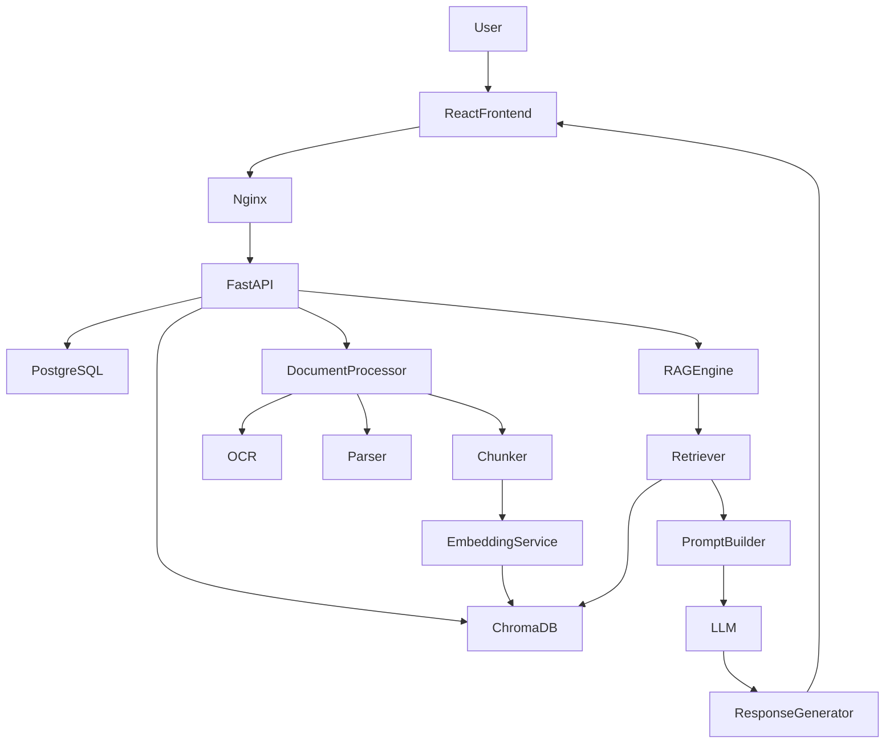

---

# Architecture Layers

The system is divided into seven logical layers.

```text
Presentation Layer
↓

API Layer
↓

Business Layer
↓

AI Layer
↓

Persistence Layer
↓

Infrastructure Layer
↓

Monitoring Layer
```

---

# Layer Responsibilities

## Presentation Layer

Responsibilities:

- User Interface
- Authentication
- Dashboard
- Document Upload
- Chat
- Search
- Settings

Technology

- React
- TypeScript
- Tailwind CSS

---

## API Layer

Responsibilities

- REST APIs
- JWT Validation
- Request Validation
- Response Formatting
- Error Handling

Technology

- FastAPI

---

## Business Layer

Responsibilities

- Workspace Management
- Document Management
- Chat Management
- Search
- Notifications

---

## AI Layer

Responsibilities

- Text Extraction
- OCR
- Chunking
- Embedding Generation
- Semantic Retrieval
- Prompt Engineering
- LLM Response Generation

Technology

- LangChain
- Ollama
- HuggingFace
- ChromaDB

---

## Persistence Layer

Stores:

- Users
- Workspaces
- Documents
- Metadata
- Chat History
- Embeddings

Technologies

- PostgreSQL
- ChromaDB

---

## Infrastructure Layer

Responsibilities

- Docker
- File Storage
- Reverse Proxy
- Configuration
- Logging

Technology

- Docker
- Nginx

---

## Monitoring Layer

Responsibilities

- Metrics
- Logs
- Alerts
- Health Checks

Future

- Prometheus
- Grafana

---

# 5. Component Architecture

## Frontend

Modules

- Authentication
- Dashboard
- Workspace
- Documents
- Search
- Chat
- Settings
- Notifications

---

## Backend

Modules

- Auth Service
- User Service
- Workspace Service
- Document Service
- Chat Service
- Search Service
- AI Service
- Notification Service

---

## AI Components

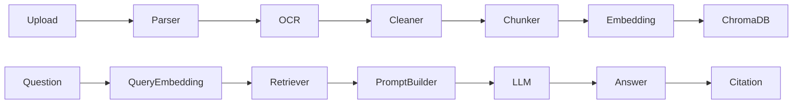

---

# 6. Technology Stack

## Frontend

| Technology | Purpose |
|------------|---------|
| React | UI |
| TypeScript | Type Safety |
| Tailwind CSS | Styling |
| React Query | Server State |
| Zustand | Client State |

---

## Backend

| Technology | Purpose |
|------------|---------|
| FastAPI | REST APIs |
| SQLAlchemy | ORM |
| Alembic | Migrations |
| Pydantic | Validation |

---

## AI

| Technology | Purpose |
|------------|---------|
| LangChain | AI Orchestration |
| Ollama | Local LLM Runtime |
| HuggingFace | Embeddings |
| ChromaDB | Vector Database |

---

## Database

| Technology | Purpose |
|------------|---------|
| PostgreSQL | Relational Data |
| ChromaDB | Vector Storage |

---

## Infrastructure

| Technology | Purpose |
|------------|---------|
| Docker | Containerization |
| Nginx | Reverse Proxy |
| GitHub Actions | CI/CD |

---

# 7. Request Flow

```text
User

↓

React Frontend

↓

REST API

↓

JWT Validation

↓

Business Service

↓

AI Service

↓

Retriever

↓

Prompt Builder

↓

LLM

↓

Response

↓

Frontend
```

---

# 8. Document Processing Pipeline

```text
Upload

↓

Validation

↓

Storage

↓

Parser

↓

OCR

↓

Cleaner

↓

Chunking

↓

Embedding

↓

Vector Database

↓

Ready for Search
```

---

# 9. RAG Pipeline Overview

```text
Question

↓

Embedding

↓

Vector Search

↓

Top K Chunks

↓

Prompt

↓

LLM

↓

Response

↓

Citation
```

---

# 10. Security Overview

Authentication

- JWT Access Token
- Refresh Token

Authorization

- Role-Based Access Control (RBAC)

Data Protection

- HTTPS
- Password Hashing (bcrypt)
- Input Validation
- File Validation

Future

- Encryption at Rest
- Secrets Manager
- Multi-Factor Authentication

---

# 11. Scalability Strategy

Current

- Single FastAPI Instance
- Local ChromaDB
- PostgreSQL

Phase 2

- Multiple FastAPI Instances
- Redis Cache
- Shared Storage

Phase 3

- Kubernetes
- Load Balancer
- Distributed Vector Database
- Object Storage (S3 Compatible)

---

# 12. Conclusion

The proposed architecture provides a modular, scalable, and production-ready foundation for the AI Document Assistant. By separating concerns across presentation, API, business, AI, persistence, infrastructure, and monitoring layers, the system can evolve from an MVP into an enterprise SaaS platform while maintaining performance, security, and maintainability.
---

# 13. Detailed Component Architecture

The AI Document Assistant is built using a modular service-oriented architecture.

Each component has a clearly defined responsibility and communicates through REST APIs or internal service interfaces.

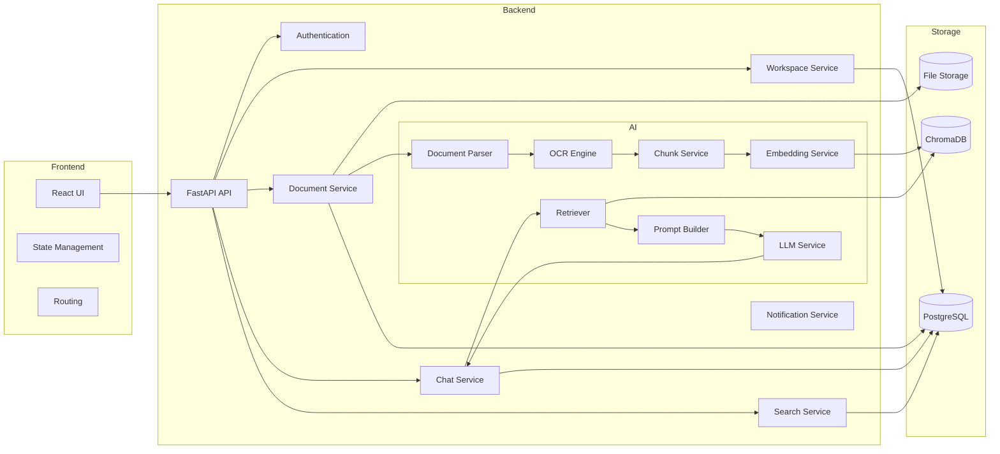

---

# 14. Service Responsibilities

## Authentication Service

Responsibilities

- User Registration
- Login
- Logout
- Refresh Token
- Password Reset
- Email Verification

Dependencies

- PostgreSQL
- JWT
- bcrypt

---

## Workspace Service

Responsibilities

- Create Workspace
- Rename Workspace
- Delete Workspace
- Statistics

---

## Document Service

Responsibilities

- Upload
- Validation
- Storage
- Metadata
- Versioning
- Processing Trigger

---

## AI Service

Responsibilities

- OCR
- Parsing
- Chunking
- Embeddings
- Prompt Building
- Response Generation

---

## Search Service

Responsibilities

- Keyword Search
- Semantic Search
- Filtering
- Ranking

---

## Chat Service

Responsibilities

- Conversation History
- Context Management
- AI Communication
- Citation Formatting

---

# 15. Service Communication

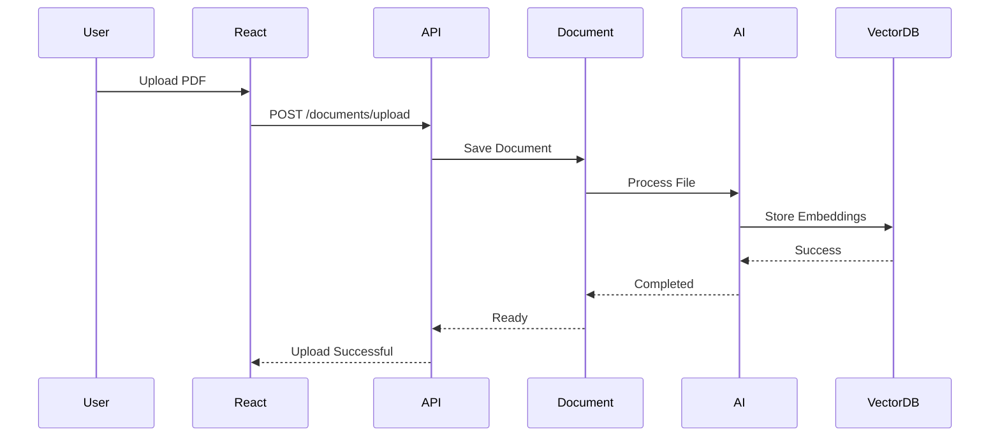

---

# 16. AI Service Communication

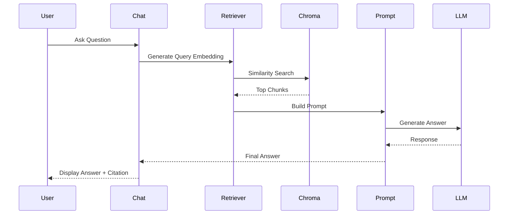

---

# 17. Deployment Architecture

```mermaid
flowchart TD

Internet

↓

NGINX

↓

React App

↓

FastAPI

↓

PostgreSQL

FastAPI --> ChromaDB

FastAPI --> File Storage

FastAPI --> Ollama

FastAPI --> Background Workers
```

---

# Deployment Components

## NGINX

Responsibilities

- Reverse Proxy
- SSL Termination
- Compression
- Static Files
- Load Balancing (Future)

---

## React Frontend

Responsibilities

- UI
- API Calls
- Authentication
- Routing

---

## FastAPI Backend

Responsibilities

- Business Logic
- REST APIs
- AI Integration

---

## PostgreSQL

Stores

- Users
- Workspaces
- Documents
- Chats
- Metadata

---

## ChromaDB

Stores

- Embeddings
- Chunk Metadata
- Similarity Index

---

## Ollama

Hosts

- Qwen
- Llama
- Gemma
- Mistral

---

# 18. Network Architecture

```mermaid
flowchart LR

Client

↓

Internet

↓

NGINX

↓

FastAPI

↓

Internal Network

↓

PostgreSQL

↓

ChromaDB

↓

Ollama
```

---

# Network Zones

## Public Zone

- React
- NGINX

---

## Private Zone

- FastAPI

---

## Database Zone

- PostgreSQL
- ChromaDB

---

## AI Zone

- Ollama

---

# 19. Infrastructure Architecture

```mermaid
flowchart TD

Docker Host

subgraph Containers

Frontend

Backend

PostgreSQL

ChromaDB

Ollama

Worker

NGINX

end

Volumes

Logs

Backups
```

---

# Docker Containers

## Frontend Container

React Application

---

## Backend Container

FastAPI

---

## Database Container

PostgreSQL

---

## Vector Container

ChromaDB

---

## AI Container

Ollama

---

## Worker Container

Background Jobs

---

## Reverse Proxy

NGINX

---

# 20. Configuration Management

Environment Variables

```env
DATABASE_URL=

CHROMA_PATH=

OLLAMA_HOST=

JWT_SECRET=

JWT_EXPIRE=

UPLOAD_DIR=

LOG_LEVEL=
```

---

Configuration Sources

- .env

- Docker Secrets (Future)

- Kubernetes Secrets

---

# 21. Background Job Architecture

Background Tasks

- OCR
- Embeddings
- PDF Parsing
- Notifications
- Cleanup

```mermaid
flowchart LR

Upload

↓

Queue

↓

Worker

↓

Parser

↓

Embedding

↓

VectorDB
```

---

# 22. Storage Architecture

## File Storage

Stores

- Original Files
- Thumbnails
- OCR Output

Future

AWS S3

Azure Blob Storage

Google Cloud Storage

---

## Metadata Storage

PostgreSQL

Stores

- Users
- Chats
- Documents
- Workspaces

---

## Vector Storage

ChromaDB

Stores

- Embeddings
- Metadata
- Similarity Index

---

# 23. Logging Architecture

Log Categories

- Authentication
- API
- Database
- AI
- OCR
- Search
- Errors
- Security

Future Stack

- ELK
- Loki
- Grafana

---

# 24. Monitoring Architecture

Health Checks

```text
GET /health

GET /health/db

GET /health/vector

GET /health/llm
```

Metrics

- CPU
- RAM
- GPU
- API Requests
- Response Time
- Embedding Count
- Chat Count
- Error Rate

Future

Prometheus

Grafana

AlertManager

---

# 25. Disaster Recovery

Backup Strategy

- Daily PostgreSQL Backup
- Daily File Backup
- Weekly Configuration Backup

Recovery

- Restore Database
- Restore Files
- Rebuild Embeddings (if required)

Target

- RPO: 24 Hours
- RTO: 30 Minutes

---

# 26. Architecture Decisions (ADR Summary)

| Decision | Reason |
|----------|--------|
| FastAPI | High performance, async support |
| React | Component-based UI |
| PostgreSQL | Reliable relational database |
| ChromaDB | Lightweight vector search |
| LangChain | RAG orchestration |
| Ollama | Local LLM execution |
| Docker | Consistent deployment |
| NGINX | Reverse proxy & SSL |
| JWT | Stateless authentication |

---

# End of Part 2

---

# 27. Database Architecture

## Overview

The AI Document Assistant uses a **polyglot persistence architecture**, combining:

- **PostgreSQL** for transactional and relational data
- **ChromaDB** for vector embeddings and semantic search
- **File Storage** for original uploaded documents

Each storage technology is selected based on its strengths.

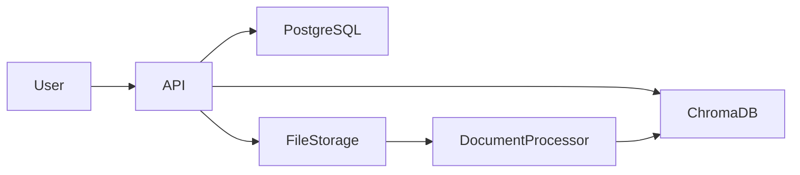

---

# 28. PostgreSQL Schema

## Core Tables

```text
users
│
├── workspaces
│     │
│     ├── documents
│     │      │
│     │      ├── document_versions
│     │      └── document_chunks
│     │
│     └── chat_sessions
│             │
│             └── chat_messages
│
├── notifications
├── settings
├── refresh_tokens
└── audit_logs
```

---

## Entity Relationships

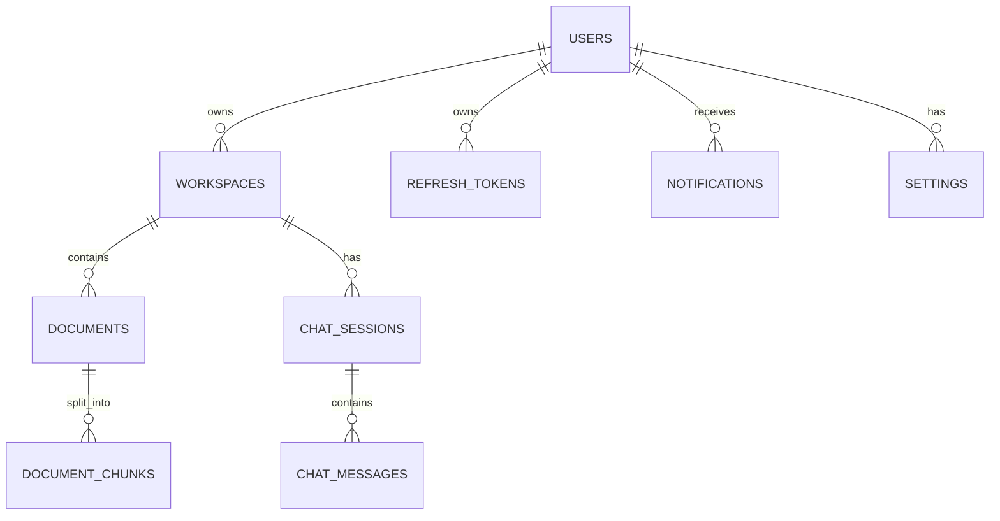

---

# 29. ChromaDB Architecture

## Purpose

ChromaDB stores vector embeddings generated from document chunks.

Each record contains:

- Embedding Vector
- Chunk Text
- Metadata
- Document ID
- Workspace ID
- Page Number
- Chunk Number

---

## Collection Structure

```text
Collection

↓

Embedding

↓

Metadata

↓

Document Reference

↓

Chunk Text
```

---

## Example Metadata

```json
{
  "workspace_id": "ws_001",
  "document_id": "doc_010",
  "page": 12,
  "chunk": 3,
  "source": "Employee_Handbook.pdf",
  "uploaded_by": "user_001"
}
```

---

# 30. Document Processing Storage Flow

```mermaid
flowchart TD

Upload

↓

Store File

↓

Extract Text

↓

Chunk

↓

Embedding

↓

Store Vector

↓

Ready
```

---

# 31. Indexing Strategy

## PostgreSQL Indexes

| Table | Index |
|--------|-------|
| users | email |
| workspaces | user_id |
| documents | workspace_id |
| documents | upload_date |
| chat_messages | session_id |
| refresh_tokens | token |

---

## ChromaDB Index

Each embedding is indexed by:

- Workspace ID
- Document ID
- Chunk Number
- Page Number
- Embedding Vector

---

## Search Flow

```text
Question

↓

Embedding Model

↓

Query Vector

↓

Similarity Search

↓

Top K Results

↓

Return Context
```

---

# 32. Chunking Strategy

## Chunk Size

Default

```
800 Characters
```

---

## Overlap

```
150 Characters
```

---

## Why Overlap?

Without overlap

```text
Chunk A

------------

Chunk B
```

Important context may be lost.

With overlap

```text
Chunk A

-----------

Shared Context

-----------

Chunk B
```

The overlap preserves sentence continuity and improves retrieval quality.

---

# 33. Embedding Strategy

## Embedding Model

Recommended

- BAAI/bge-large-en-v1.5
- bge-base
- all-MiniLM-L6-v2 (development)

---

## Embedding Flow

```mermaid
flowchart LR

Chunk

↓

Embedding Model

↓

Vector

↓

Store
```

---

## Vector Dimensions

| Model | Dimensions |
|--------|-----------:|
| MiniLM | 384 |
| BGE Base | 768 |
| BGE Large | 1024 |

---

# 34. Retrieval Strategy

## Similarity Search

Default

Top K = 5

---

## Retrieval Steps

1. User submits question.
2. Generate query embedding.
3. Search ChromaDB.
4. Rank by cosine similarity.
5. Retrieve top chunks.
6. Build prompt.
7. Send to LLM.

---

## Similarity Metric

Cosine Similarity

```text
1.0

Highly Similar

↓

0.0

Unrelated
```

---

# 35. Caching Architecture

## Why Cache?

Avoid repeated computations.

---

## Future Redis Cache

```mermaid
flowchart LR

User

↓

API

↓

Redis

↓

Database
```

---

## Cached Items

- User profile
- Workspace metadata
- Frequently used prompts
- Recent search results
- LLM model information

---

# 36. Data Lifecycle

```mermaid
flowchart TD

Upload

↓

Store

↓

Process

↓

Index

↓

Search

↓

Archive

↓

Delete
```

---

## Lifecycle Stages

### Upload

Original file stored.

---

### Processing

- Parse
- OCR
- Chunk
- Embed

---

### Active

Document available for search and chat.

---

### Archive

Future feature.

---

### Delete

Removes:

- File
- Metadata
- Chunks
- Embeddings
- Chat references (if configured)

---

# 37. File Storage Structure

```text
storage/

uploads/

    workspace_001/

        employee_handbook.pdf

        leave_policy.docx

processed/

ocr/

thumbnails/

exports/

logs/
```

---

# 38. Backup Strategy

## PostgreSQL

Daily Backup

Retention

30 Days

---

## ChromaDB

Weekly Snapshot

Retention

14 Days

---

## Uploaded Files

Daily Backup

Retention

90 Days

---

# 39. Data Integrity

## Database Constraints

- Primary Keys
- Foreign Keys
- Unique Email
- Cascade Deletes
- Transaction Rollbacks

---

## AI Data Integrity

Every embedding must have:

- Document ID
- Workspace ID
- Page Number
- Chunk Number
- Source File

---

# 40. Data Retention Policy

| Data | Retention |
|------|-----------|
| User Account | Until deleted |
| Documents | Until deleted |
| Embeddings | Until document deletion |
| Chat History | Configurable |
| Logs | 90 Days |
| Audit Logs | 1 Year |

---

# 41. Future Database Enhancements

## Relational

- Read Replicas
- Partitioning
- Connection Pooling

---

## Vector Database

- Qdrant Cluster
- Pinecone
- Weaviate
- Milvus

---

## Storage

- AWS S3
- Azure Blob Storage
- Google Cloud Storage

---

## Search

- Hybrid Search
- BM25 + Vector Search
- Re-ranking Models
- Cross Encoder Ranking

---

# 42. Architecture Decisions (Data Layer)

| Decision | Reason |
|----------|--------|
| PostgreSQL | ACID transactions, mature ecosystem |
| ChromaDB | Lightweight vector storage for MVP |
| Separate File Storage | Efficient handling of large documents |
| Chunk Overlap | Better semantic continuity |
| Cosine Similarity | Effective semantic retrieval |
| Metadata-rich Embeddings | Faster filtering and citations |
| Daily Backups | Disaster recovery |
| Redis (Future) | Reduced latency and improved scalability |

---

# End of Part 3
---

# 43. Sequence Diagrams

## 43.1 User Login

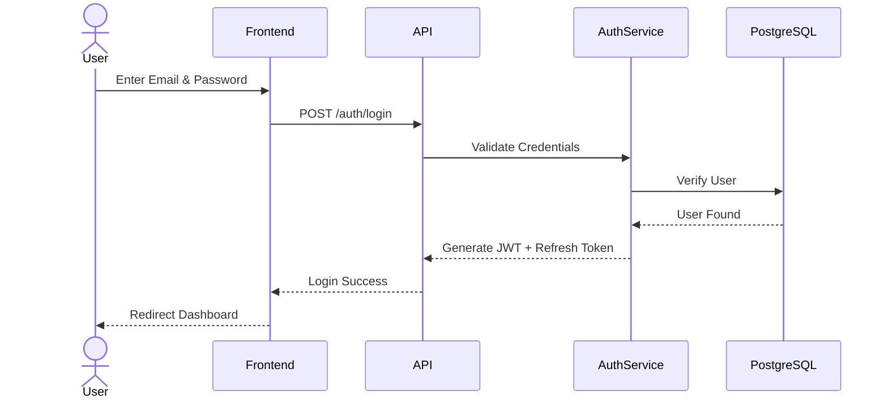

---

## 43.2 Document Upload

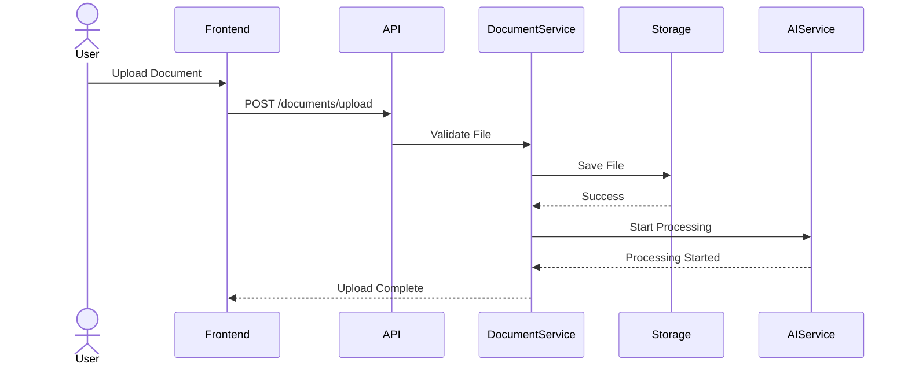

---

## 43.3 AI Chat Request

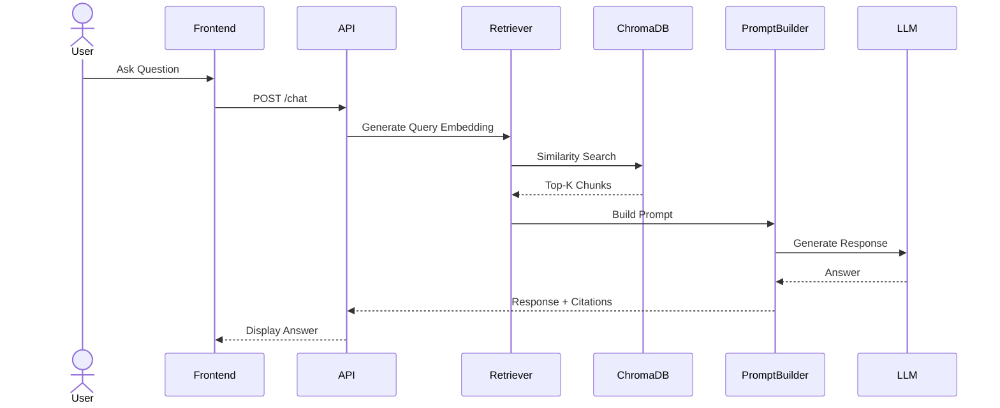

---

# 44. Class Diagram

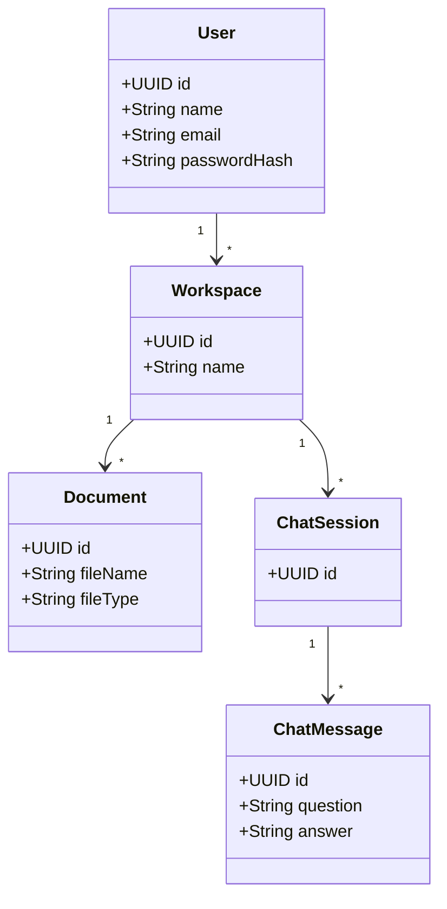

---

# 45. State Diagrams

## 45.1 Document State

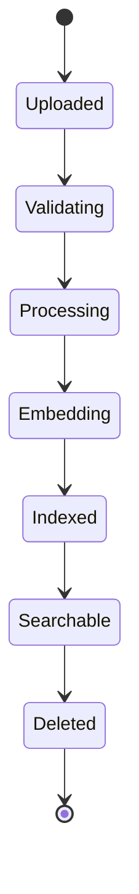

---

## 45.2 Chat Session State

```mermaid
stateDiagram-v2

[*] --> Created
Created --> Active
Active --> Waiting
Waiting --> Active
Active --> Closed
Closed --> Archived
Archived --> [*]
```

---

# 46. Authentication Flow

## JWT Authentication

```mermaid
flowchart TD

User --> Login

Login --> API

API --> VerifyUser

VerifyUser --> GenerateJWT

GenerateJWT --> AccessToken

GenerateJWT --> RefreshToken

AccessToken --> Client

RefreshToken --> Client
```

### Access Token

Purpose

- API Authorization

Lifetime

15 Minutes

---

### Refresh Token

Purpose

Generate New Access Token

Lifetime

7 Days

Stored

HTTP Only Cookie (Recommended)

---

### Refresh Flow

```mermaid
sequenceDiagram

User->>API: Expired Access Token
API-->>User: 401 Unauthorized

User->>API: POST /auth/refresh
API->>Database: Validate Refresh Token
Database-->>API: Valid
API-->>User: New Access Token
```

---

# 47. Kubernetes Architecture

```mermaid
flowchart TD

Internet

↓

Ingress

↓

Frontend Pods

↓

Backend Pods

↓

Redis

↓

PostgreSQL

↓

ChromaDB

↓

Ollama GPU Pods
```

---

## Kubernetes Components

### Ingress Controller

- SSL
- Routing
- Load Balancing

### Frontend Deployment

- React Pods
- Horizontal Pod Autoscaler

### Backend Deployment

- FastAPI Pods
- Auto Scaling

### Worker Deployment

- OCR Workers
- Embedding Workers

### AI Deployment

- Ollama GPU Nodes

---

# 48. Cloud Architecture

```mermaid
flowchart LR

Users

↓

Cloud Load Balancer

↓

NGINX

↓

FastAPI Cluster

↓

Redis

↓

PostgreSQL

↓

Object Storage

↓

ChromaDB Cluster

↓

LLM Cluster
```

---

## Cloud Services (Example)

| Layer | AWS | Azure | GCP |
|--------|-----|-------|-----|
| Compute | EKS | AKS | GKE |
| Database | RDS | Azure Database | Cloud SQL |
| Object Storage | S3 | Blob Storage | Cloud Storage |
| Monitoring | CloudWatch | Azure Monitor | Cloud Monitoring |
| Secrets | Secrets Manager | Key Vault | Secret Manager |

---

# 49. High Availability

## Backend

- Multiple FastAPI Instances
- Stateless APIs
- Load Balancer

---

## Database

- Primary + Read Replica
- Automatic Failover

---

## Vector Database

- Replication
- Periodic Snapshots

---

## File Storage

- Object Storage Replication

---

## AI Layer

- Multiple LLM Instances
- Model Failover
- Health Checks

---

# 50. Scalability Strategy

## Horizontal Scaling

- Additional Backend Pods
- More Worker Pods
- Additional GPU Nodes

---

## Vertical Scaling

- Increase CPU
- Increase Memory
- Upgrade GPU

---

## Auto Scaling

Based On

- CPU Usage
- Memory Usage
- Request Rate
- Queue Length

---

# 51. Security Architecture

## Network Security

- HTTPS
- TLS 1.3
- Reverse Proxy
- Private Database Network

---

## Application Security

- JWT Authentication
- RBAC
- Input Validation
- File Validation
- Rate Limiting

---

## Data Security

- Password Hashing (bcrypt)
- Encrypted Secrets
- Audit Logs
- Daily Backups

---

## Future Enhancements

- Multi-Factor Authentication
- Single Sign-On (SSO)
- Encryption at Rest
- Key Management Service (KMS)

---

# 52. Observability

## Logging

- API Logs
- Authentication Logs
- AI Logs
- OCR Logs
- Worker Logs

---

## Metrics

- Request Count
- Error Rate
- Response Time
- Token Usage
- Embedding Count
- Queue Length

---

## Monitoring Stack

- Prometheus
- Grafana
- Loki
- Alertmanager

---

# 53. Production Readiness Checklist

## Application

- Clean Architecture
- Dependency Injection
- Environment Configuration
- Graceful Shutdown
- Health Endpoints

---

## Security

- HTTPS
- JWT
- Refresh Tokens
- Password Hashing
- Rate Limiting
- Input Validation
- CORS

---

## AI

- Prompt Versioning
- Citation Support
- Fallback Responses
- Embedding Validation

---

## Infrastructure

- Docker
- NGINX
- CI/CD
- Kubernetes
- Backups
- Monitoring

---

# 54. Risks & Mitigations

| Risk | Mitigation |
|------|------------|
| Large PDFs | Background Processing |
| Slow Embeddings | Batch Processing |
| LLM Timeout | Retry + Timeout Handling |
| Storage Growth | Object Storage |
| High Traffic | Horizontal Scaling |
| Database Bottleneck | Read Replicas |
| GPU Failure | Multiple AI Nodes |
| ChromaDB Failure | Snapshots + Restore |

---

# 55. Future Architecture Roadmap

## Phase 1

- Single Server
- Docker Compose
- Local Ollama
- PostgreSQL
- ChromaDB

---

## Phase 2

- Redis Cache
- Background Queue
- Object Storage
- CI/CD

---

## Phase 3

- Kubernetes
- Multi-GPU LLM Cluster
- Distributed Vector Database
- Multi-Tenant SaaS

---

## Phase 4

- Multi-Region Deployment
- Global Load Balancer
- Disaster Recovery Site
- Enterprise SSO
- Hybrid Search
- AI Agents
- Workflow Automation

---

# 56. Architecture Summary

The AI Document Assistant follows a layered, modular architecture with clear separation between presentation, business logic, AI services, persistence, and infrastructure. The design supports secure document ingestion, Retrieval-Augmented Generation (RAG), scalable deployment, and future cloud-native evolution. By combining PostgreSQL for transactional data, ChromaDB for vector search, LangChain for orchestration, and Ollama-hosted LLMs, the system provides a production-ready foundation that can evolve from an MVP into a highly available enterprise platform.

---

# End of System Architecture Document

**Document Version:** 1.0

**Status:** Approved for Implementation