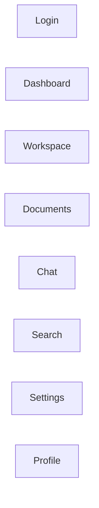
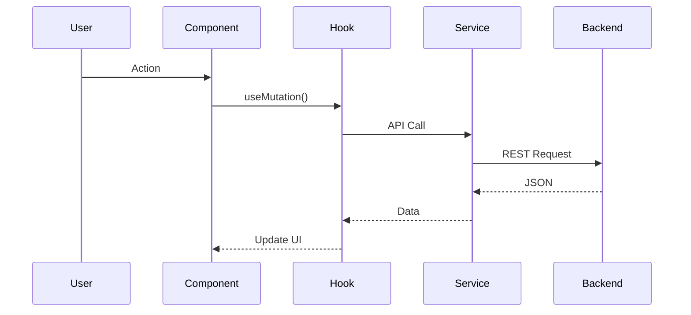

# Frontend Architecture

**Project:** AI Document Assistant

**Version:** 1.0

**Document Type:** Frontend Architecture Document

---

# Table of Contents

1. Introduction
2. Frontend Goals
3. Architecture Overview
4. Folder Structure
5. Application Layers
6. Routing Architecture
7. UI Component Library
8. State Management
9. API Integration
10. Authentication Flow
11. Form Management
12. Theme Architecture
13. Performance Optimization
14. Error Handling
15. Security Considerations
16. Build & Deployment
17. Coding Standards

---

# 1. Introduction

The frontend is built as a **Single Page Application (SPA)** using **React**, **TypeScript**, and **Tailwind CSS**. It communicates with the backend through REST APIs and provides a responsive, accessible, and modular user interface.

---

# 2. Frontend Goals

The frontend architecture aims to provide:

- Modular design
- Reusable UI components
- Type safety
- Fast rendering
- Responsive layouts
- Accessibility (WCAG 2.1)
- Easy testing
- Maintainability
- Scalability

---

# 3. Architecture Overview

```mermaid
flowchart TD

Browser

↓

React Application

↓

Routes

↓

Pages

↓

Feature Components

↓

Shared UI Components

↓

Hooks

↓

API Services

↓

FastAPI Backend
```

---

# 4. Folder Structure

```text

src/
│
│
|
│
├── assets/
│   ├── images/
│   ├── icons/
│   ├── logos/
│   ├── fonts/
│   └── animations/
│
├── ui/                          # Reusable UI Components
│
│   ├── button/
│   │     Button.tsx
│   │     IconButton.tsx
│   │     FloatingButton.tsx
│   │
│   ├── input/
│   │     Input.tsx
│   │     PasswordInput.tsx
│   │     SearchInput.tsx
│   │     TextArea.tsx
│   │     NumberInput.tsx
│   │
│   ├── select/
│   │     Select.tsx
│   │     MultiSelect.tsx
│   │
│   ├── checkbox/
│   │     Checkbox.tsx
│   │
│   ├── radio/
│   │     Radio.tsx
│   │
│   ├── switch/
│   │     Switch.tsx
│   │
│   ├── date-picker/
│   │     DatePicker.tsx
│   │
│   ├── upload/
│   │     FileUpload.tsx
│   │     DragDrop.tsx
│   │     ImageUpload.tsx
│   │
│   ├── card/
│   │     Card.tsx
│   │     InfoCard.tsx
│   │     StatsCard.tsx
│   │
│   ├── table/
│   │     Table.tsx
│   │     TableHeader.tsx
│   │     TableRow.tsx
│   │     Pagination.tsx
│   │     EmptyState.tsx
│   │
│   ├── modal/
│   │     Modal.tsx
│   │     ConfirmDialog.tsx
│   │     AlertDialog.tsx
│   │
│   ├── drawer/
│   │     Drawer.tsx
│   │
│   ├── tabs/
│   │     Tabs.tsx
│   │
│   ├── accordion/
│   │     Accordion.tsx
│   │
│   ├── breadcrumb/
│   │     Breadcrumb.tsx
│   │
│   ├── badge/
│   │     Badge.tsx
│   │
│   ├── avatar/
│   │     Avatar.tsx
│   │
│   ├── tooltip/
│   │     Tooltip.tsx
│   │
│   ├── popover/
│   │     Popover.tsx
│   │
│   ├── dropdown/
│   │     Dropdown.tsx
│   │
│   ├── menu/
│   │     Menu.tsx
│   │
│   ├── chip/
│   │     Chip.tsx
│   │
│   ├── progress/
│   │     ProgressBar.tsx
│   │     CircularProgress.tsx
│   │
│   ├── spinner/
│   │     Spinner.tsx
│   │
│   ├── skeleton/
│   │     Skeleton.tsx
│   │
│   ├── toast/
│   │     Toast.tsx
│   │     ToastProvider.tsx
│   │
│   ├── alert/
│   │     Alert.tsx
│   │
│   ├── notification/
│   │     Notification.tsx
│   │
│   ├── timeline/
│   │     Timeline.tsx
│   │
│   ├── pdf-viewer/
│   │     PdfViewer.tsx
│   │
│   ├── markdown/
│   │     Markdown.tsx
│   │
│   ├── empty/
│   │     EmptyState.tsx
│   │
│   ├── error/
│   │     ErrorBoundary.tsx
│   │
│   ├── layout/
│   │     Page.tsx
│   │     Section.tsx
│   │     Container.tsx
│   │
│   └── typography/
│         Heading.tsx
│         Text.tsx
│         Label.tsx
│
├── features/
│
│   ├── auth/
│   │     pages/
│   │        Login.tsx
│   │        Register.tsx
│   │        ForgotPassword.tsx
│   │        ResetPassword.tsx
│   │
│   │     components/
│   │        LoginForm.tsx
│   │        RegisterForm.tsx
│   │
│   │     services/
│   │        auth.api.ts
│   │
│   │     hooks/
│   │        useAuth.ts
│   │
│   │     types.ts
│   │
│   ├── dashboard/
│   │     pages/
│   │        Dashboard.tsx
│   │
│   │     components/
│   │        WorkspaceCard.tsx
│   │        RecentDocuments.tsx
│   │        Stats.tsx
│   │
│   ├── workspace/
│   │     pages/
│   │        Workspace.tsx
│   │
│   │     components/
│   │        WorkspaceHeader.tsx
│   │        WorkspaceSidebar.tsx
│   │
│   ├── documents/
│   │     pages/
│   │        DocumentLibrary.tsx
│   │        Upload.tsx
│   │        DocumentViewer.tsx
│   │
│   │     components/
│   │        UploadCard.tsx
│   │        DocumentCard.tsx
│   │        DocumentTable.tsx
│   │        ProcessingStatus.tsx
│   │
│   │     services/
│   │        document.api.ts
│   │
│   ├── chat/
│   │     pages/
│   │        Chat.tsx
│   │
│   │     components/
│   │        ChatInput.tsx
│   │        ChatBubble.tsx
│   │        ChatHistory.tsx
│   │        CitationPanel.tsx
│   │        SuggestedQuestions.tsx
│   │
│   │     services/
│   │        chat.api.ts
│   │
│   ├── search/
│   │     pages/
│   │        Search.tsx
│   │
│   │     components/
│   │        SearchBar.tsx
│   │        SearchFilters.tsx
│   │        SearchResults.tsx
│   │
│   ├── settings/
│   │     pages/
│   │        Settings.tsx
│   │
│   │     components/
│   │        ProfileSettings.tsx
│   │        ModelSettings.tsx
│   │        WorkspaceSettings.tsx
│   │
│   ├── profile/
│   │     pages/
│   │        Profile.tsx
│   │
│   ├── notifications/
│   │     pages/
│   │        Notifications.tsx
│   │
│   └── activity/
│         pages/
│            Activity.tsx
│
├── layouts/
│   MainLayout.tsx
│   AuthLayout.tsx
│   DashboardLayout.tsx
│
├── routes/
│   AppRoutes.tsx
│   PrivateRoute.tsx
│
├── hooks/
│   useDebounce.ts
│   usePagination.ts
│   useLocalStorage.ts
│   useTheme.ts
│
├── services/
│   api.ts
│   axios.ts
│   interceptor.ts
│
├── store/
│   auth.store.ts
│   user.store.ts
│   workspace.store.ts
│   chat.store.ts
│   document.store.ts
│
├── context/
│   ThemeContext.tsx
│
├── constants/
│   routes.ts
│   roles.ts
│   api.ts
│
├── types/
│   auth.ts
│   chat.ts
│   document.ts
│   workspace.ts
│   common.ts
│
├── utils/
│   date.ts
│   validation.ts
│   file.ts
│   formatter.ts
│   download.ts
│
├── styles/
│   globals.css
│   tailwind.css
│   variables.css
│
├── App.tsx
├── main.tsx
└── vite.config.ts
```

---

# 5. Application Layers

```mermaid
flowchart TD

Pages

↓

Feature Components

↓

Reusable UI Components

↓

Hooks

↓

Services

↓

REST API
```

---

## Pages Layer

Responsible for:

- Route rendering
- Layout composition
- Feature orchestration

Examples:

- Login Page
- Dashboard
- Workspace
- Chat
- Settings

---

## Feature Layer

Each feature is self-contained.

Example:

```text
features/chat/

ChatPage.tsx

components/

hooks/

services/

types/

utils/
```

---

## Shared Components

Reusable across the application.

Examples:

- Button
- Modal
- Table
- Card
- Input
- Toast
- Avatar
- Badge
- Spinner
- Skeleton
- Breadcrumb

---

# 6. Routing Architecture



---

## Public Routes

- Login
- Register
- Forgot Password

---

## Protected Routes

- Dashboard
- Workspaces
- Documents
- Chat
- Settings

Protected routes require a valid JWT.

---

# 7. UI Component Library

## Buttons

Variants:

- Primary
- Secondary
- Outline
- Ghost
- Destructive

---

## Inputs

- Text
- Password
- Email
- Search
- File Upload
- TextArea

---

## Navigation

- Sidebar
- Topbar
- Breadcrumb
- Tabs

---

## Feedback

- Toast
- Alert
- Modal
- Dialog
- Progress Bar
- Loading Spinner
- Skeleton Loader

---

## Data Display

- Table
- Card
- Timeline
- Badge
- Avatar
- Tooltip

---

# 8. State Management

## Global State (Zustand)

Stores:

- User
- JWT
- Theme
- Workspace
- Notifications

---

## Server State (React Query)

Caches:

- User Profile
- Documents
- Chat History
- Search Results

Benefits:

- Automatic caching
- Background refresh
- Retry handling

---

## Local Component State

Managed with:

- useState
- useReducer

---

# 9. API Integration



---

## API Service Structure

```text
services/

api.ts

auth.service.ts

workspace.service.ts

document.service.ts

chat.service.ts

search.service.ts
```

---

## Axios Configuration

Features:

- Base URL
- JWT Interceptor
- Error Handling
- Refresh Token Logic
- Request Timeout

---

# 10. Authentication Flow

```mermaid
flowchart TD

Login

↓

JWT Token

↓

Store Securely

↓

API Requests

↓

401?

↓

Refresh Token

↓

Retry Request
```

---

## Token Storage

Recommended:

- Access Token: Memory
- Refresh Token: HTTP-only Cookie

---

# 11. Form Management

Recommended Library:

React Hook Form

Validation:

Zod

Benefits:

- Minimal re-renders
- Type-safe validation
- Easy error handling

---

# 12. Theme Architecture

Supported Themes:

- Light
- Dark

Future:

- High Contrast

Theme stored in Zustand and persisted to Local Storage.

---

# 13. Performance Optimization

## Code Splitting

Use:

React.lazy()

Suspense

---

## Lazy Loading

Pages loaded on demand.

---

## Memoization

Use:

- React.memo
- useMemo
- useCallback

---

## Virtualization

Large tables:

react-window

---

## Image Optimization

- Lazy loading
- Responsive images
- WebP support

---

# 14. Error Handling

Global Error Boundary

Displays:

- Friendly error message
- Retry button
- Support information

---

## API Errors

Centralized handling:

- 400 Validation
- 401 Unauthorized
- 403 Forbidden
- 404 Not Found
- 500 Internal Server Error

---

# 15. Security Considerations

- Escape user input
- Prevent XSS
- CSRF protection (future)
- Secure token handling
- Route guards
- File validation before upload

---

# 16. Build & Deployment

## Development

```bash
npm install
npm run dev
```

---

## Production Build

```bash
npm run build
```

Output:

```text
dist/
```

---

## Deployment

Served by:

NGINX

Docker Container

---

# 17. Coding Standards

## Naming

Components:

```text
PascalCase
```

Example:

```text
DocumentCard.tsx
```

---

Hooks:

```text
camelCase

useAuth.ts
```

---

Files:

```text
feature-name.ts
```

---

## Formatting

- ESLint
- Prettier
- TypeScript strict mode

---

## Imports

Order:

1. React
2. External Libraries
3. Internal Modules
4. Relative Imports

---

## Component Guidelines

- One responsibility per component
- Keep components under ~300 lines
- Extract reusable logic into hooks
- Avoid deeply nested props

---

# Frontend Technology Summary

| Category | Technology |
|----------|------------|
| Framework | React |
| Language | TypeScript |
| Styling | Tailwind CSS |
| Routing | React Router |
| State | Zustand |
| Server State | React Query |
| Forms | React Hook Form |
| Validation | Zod |
| HTTP Client | Axios |
| Build Tool | Vite |
| Testing | Vitest + React Testing Library |

---

# Frontend Best Practices Checklist

- Feature-based folder structure
- Reusable UI components
- Lazy-loaded routes
- Protected routes
- Global error boundary
- API interceptors
- Type-safe forms
- Responsive design
- Accessibility support
- Dark/Light themes
- Unit tests
- Clean code principles

---

# Conclusion

The frontend architecture emphasizes modularity, reusability, and maintainability. By combining React, TypeScript, Tailwind CSS, Zustand, React Query, and React Hook Form, the application provides a scalable foundation for enterprise-grade document management and AI-powered interactions.

---

# End of Frontend Architecture Document

**Version:** 1.0

**Status:** Approved for Development