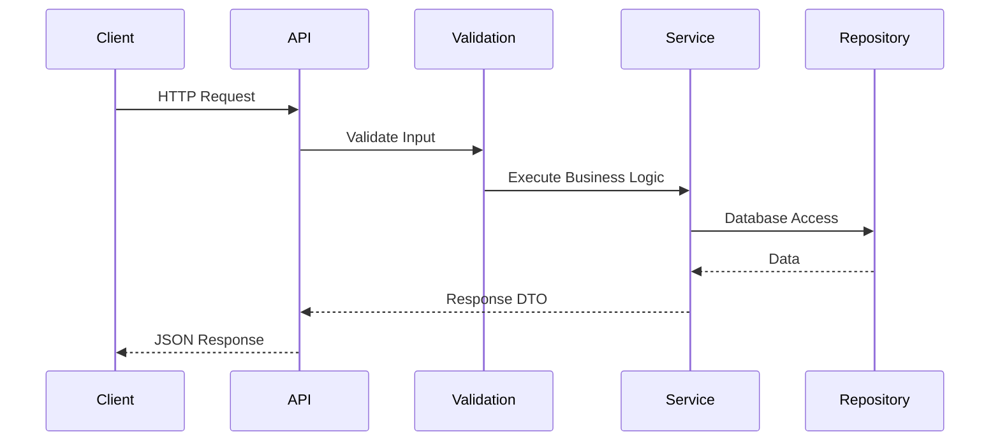
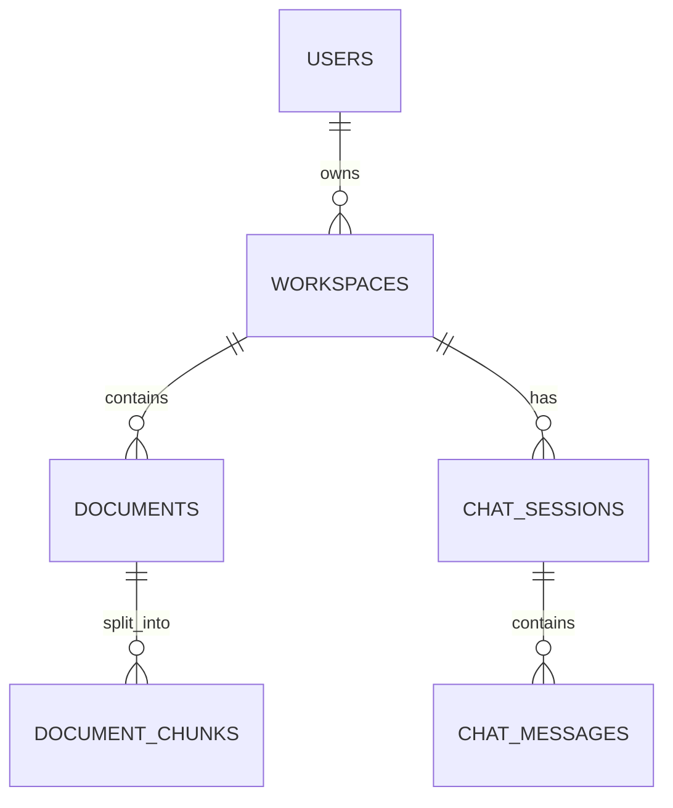
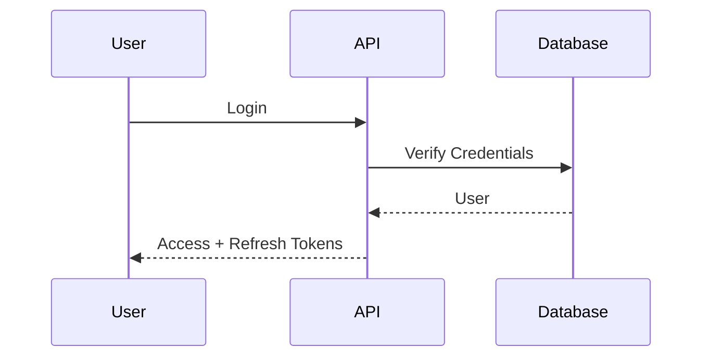

# Backend Architecture

**Project:** AI Document Assistant

**Version:** 1.0

**Document Type:** Backend Architecture Specification

---

# Table of Contents

1. Introduction
2. Architecture Goals
3. Backend Overview
4. Clean Architecture
5. Project Structure
6. API Layer
7. Service Layer
8. Repository Layer
9. Database Layer
10. AI Layer
11. Background Processing
12. Authentication & Authorization
13. Middleware
14. Exception Handling
15. Logging & Monitoring
16. Configuration Management
17. Performance Optimization
18. Coding Standards

---

# 1. Introduction

The backend is implemented using **FastAPI** following **Clean Architecture** and **SOLID principles**.

Objectives:

- High performance
- Modular services
- Easy testing
- AI integration
- Scalability
- Maintainability

---

# 2. Architecture Goals

The backend must provide:

- Stateless REST APIs
- JWT authentication
- Document management
- AI-powered chat
- Semantic search
- Background document processing
- Production security
- Cloud readiness

---

# 3. Backend Overview

```mermaid
flowchart TD

Client

↓

FastAPI

↓

API Layer

↓

Service Layer

↓

Repository Layer

↓

Database

↓

AI Layer

↓

Storage
```

---

# 4. Clean Architecture

```text
Presentation Layer
        ↓
Application Layer
        ↓
Domain Layer
        ↓
Infrastructure Layer
```

### Presentation Layer

- REST endpoints
- Request validation
- Response formatting

### Application Layer

- Business logic
- Transactions
- Workflow orchestration

### Domain Layer

- Entities
- Business rules
- Interfaces

### Infrastructure Layer

- PostgreSQL
- ChromaDB
- File storage
- External AI services

---

# 5. Project Structure

```text
backend/
│
├── app/
│
│   ├── api/
│   │
│   │   ├── auth/
│   │   │      routes.py
│   │   │      controller.py
│   │   │      service.py
│   │   │      repository.py
│   │   │      schema.py
│   │   │      model.py
│   │   │
│   │   ├── users/
│   │   │      routes.py
│   │   │      controller.py
│   │   │      service.py
│   │   │      repository.py
│   │   │      schema.py
│   │   │      model.py
│   │   │
│   │   ├── workspaces/
│   │   │      routes.py
│   │   │      controller.py
│   │   │      service.py
│   │   │      repository.py
│   │   │      schema.py
│   │   │      model.py
│   │   │
│   │   ├── documents/
│   │   │      routes.py
│   │   │      controller.py
│   │   │      service.py
│   │   │      repository.py
│   │   │      schema.py
│   │   │      model.py
│   │   │
│   │   ├── chat/
│   │   │      routes.py
│   │   │      controller.py
│   │   │      service.py
│   │   │      repository.py
│   │   │      schema.py
│   │   │      model.py
│   │   │
│   │   ├── search/
│   │   │      routes.py
│   │   │      controller.py
│   │   │      service.py
│   │   │
│   │   ├── settings/
│   │   │      routes.py
│   │   │      controller.py
│   │   │      service.py
│   │   │
│   │   └── health/
│   │          routes.py
│   │
│   ├── ai/
│   │
│   │   ├── llm/
│   │   │      ollama.py
│   │   │      qwen.py
│   │   │      llama.py
│   │   │      prompt_builder.py
│   │   │
│   │   ├── embeddings/
│   │   │      embedding_service.py
│   │   │      bge.py
│   │   │      nomic.py
│   │   │
│   │   ├── vector_db/
│   │   │      chroma.py
│   │   │      qdrant.py
│   │   │      vector_store.py
│   │   │
│   │   ├── rag/
│   │   │      chunker.py
│   │   │      retriever.py
│   │   │      reranker.py
│   │   │      generator.py
│   │   │      citation.py
│   │   │      pipeline.py
│   │   │
│   │   ├── prompts/
│   │   │      chat_prompt.txt
│   │   │      summary_prompt.txt
│   │   │      compare_prompt.txt
│   │   │      quiz_prompt.txt
│   │   │
│   │   └── models/
│   │          llm_factory.py
│   │
│   ├── document_processing/
│   │
│   │   ├── parser/
│   │   │      pdf_parser.py
│   │   │      docx_parser.py
│   │   │      excel_parser.py
│   │   │      ppt_parser.py
│   │   │      image_parser.py
│   │   │      txt_parser.py
│   │   │
│   │   ├── ocr/
│   │   │      tesseract.py
│   │   │      easyocr.py
│   │   │
│   │   ├── cleaner/
│   │   │      text_cleaner.py
│   │   │
│   │   ├── splitter/
│   │   │      recursive_splitter.py
│   │   │      semantic_splitter.py
│   │   │
│   │   └── metadata/
│   │          extractor.py
│   │
│   ├── database/
│   │
│   │   ├── models/
│   │   │      user.py
│   │   │      workspace.py
│   │   │      document.py
│   │   │      chat.py
│   │   │      message.py
│   │   │
│   │   ├── migrations/
│   │   │
│   │   ├── session.py
│   │   ├── base.py
│   │   └── init_db.py
│   │
│   ├── storage/
│   │
│   │   ├── local_storage.py
│   │   ├── s3_storage.py
│   │   ├── azure_blob.py
│   │   └── file_manager.py
│   │
│   ├── security/
│   │
│   │   ├── jwt.py
│   │   ├── password.py
│   │   ├── permissions.py
│   │   ├── oauth.py
│   │   └── auth_dependency.py
│   │
│   ├── middleware/
│   │
│   │   ├── authentication.py
│   │   ├── authorization.py
│   │   ├── logging.py
│   │   ├── rate_limit.py
│   │   ├── cors.py
│   │   └── exception_handler.py
│   │
│   ├── websocket/
│   │
│   │   ├── chat_socket.py
│   │   ├── notification_socket.py
│   │   └── connection_manager.py
│   │
│   ├── background_jobs/
│   │
│   │   ├── document_indexing.py
│   │   ├── embedding_generation.py
│   │   ├── email_sender.py
│   │   ├── cleanup.py
│   │   └── scheduler.py
│   │
│   ├── integrations/
│   │
│   │   ├── email/
│   │   │      smtp.py
│   │   │
│   │   ├── notifications/
│   │   │      push.py
│   │   │
│   │   └── analytics/
│   │          events.py
│   │
│   ├── config/
│   │
│   │   ├── settings.py
│   │   ├── constants.py
│   │   ├── logging.py
│   │   └── environment.py
│   │
│   ├── utils/
│   │
│   │   ├── file_utils.py
│   │   ├── pdf_utils.py
│   │   ├── image_utils.py
│   │   ├── date_utils.py
│   │   ├── validators.py
│   │   └── helpers.py
│   │
│   ├── tests/
│   │
│   │   ├── auth/
│   │   ├── documents/
│   │   ├── rag/
│   │   ├── chat/
│   │   └── users/
│   │
│   ├── uploads/
│   │
│   │   ├── pdf/
│   │   ├── docx/
│   │   ├── excel/
│   │   ├── images/
│   │   └── temp/
│   │
│   ├── logs/
│   │
│   ├── main.py
│   └── __init__.py
│
├── requirements.txt
├── .env
├── Dockerfile
├── docker-compose.yml
├── alembic.ini
├── README.md
└── .gitignore
```

---

# 6. API Layer

Responsibilities:

- Route definitions
- Input validation
- Authentication
- Dependency injection
- Response serialization

Example:

```python
POST /api/auth/login
POST /api/documents/upload
GET /api/workspaces
POST /api/chat
```

---

# Request Lifecycle



---

# 7. Service Layer

The Service Layer contains all business logic.

Services include:

- AuthService
- UserService
- WorkspaceService
- DocumentService
- ChatService
- SearchService
- AIService
- NotificationService

Example responsibilities:

### DocumentService

- Upload file
- Store metadata
- Trigger AI processing
- Delete documents
- Version management

---

# 8. Repository Layer

Repositories isolate database access.

Example:

```text
UserRepository
WorkspaceRepository
DocumentRepository
ChatRepository
```

Benefits:

- Testability
- Separation of concerns
- Database independence

---

# 9. Database Layer

## PostgreSQL

Stores:

- Users
- Workspaces
- Documents
- Chats
- Settings
- Refresh Tokens

---

## ChromaDB

Stores:

- Embeddings
- Metadata
- Similarity indexes

---

# Entity Relationships



---

# 10. AI Layer

Components:

- Parser
- OCR
- Cleaner
- Chunker
- Embedding Generator
- Retriever
- Prompt Builder
- LLM Client

```mermaid
flowchart LR

Upload

↓

Parser

↓

OCR

↓

Chunker

↓

Embedding

↓

ChromaDB

Question

↓

Retriever

↓

Prompt

↓

LLM

↓

Answer
```

---

# AI Service Responsibilities

- Parse documents
- Generate embeddings
- Build prompts
- Retrieve context
- Generate citations
- Handle LLM responses

---

# 11. Background Processing

Tasks:

- OCR
- Embedding generation
- PDF parsing
- Cleanup
- Notifications

```mermaid
flowchart TD

Upload

↓

Queue

↓

Worker

↓

AI Processing

↓

Database
```

Recommended:

- Celery (future)
- Dramatiq
- RQ

---

# 12. Authentication & Authorization

Authentication:

- JWT Access Token
- Refresh Token

Authorization:

- Role-Based Access Control (RBAC)

Roles:

- Guest
- User
- Admin

---

# Authentication Flow



---

# 13. Middleware

Middleware stack:

1. CORS
2. Request Logging
3. Authentication
4. Rate Limiting
5. Exception Handling
6. Response Compression

Responsibilities:

- Security
- Logging
- Performance
- Error handling

---

# 14. Exception Handling

Centralized exception handler.

Examples:

| Status | Description |
|--------|-------------|
|400|Validation Error|
|401|Unauthorized|
|403|Forbidden|
|404|Not Found|
|409|Conflict|
|422|Unprocessable Entity|
|500|Internal Server Error|

Error response format:

```json
{
  "success": false,
  "error": {
    "code": "VALIDATION_ERROR",
    "message": "Invalid request"
  }
}
```

---

# 15. Logging & Monitoring

Logging categories:

- Authentication
- API Requests
- AI Processing
- Database
- OCR
- Search
- Errors

Monitoring:

- Health endpoints
- Metrics
- Audit logs

Future stack:

- Prometheus
- Grafana
- Loki

---

# 16. Configuration Management

Environment variables:

```env
DATABASE_URL=
JWT_SECRET=
JWT_EXPIRE_MINUTES=
REFRESH_TOKEN_EXPIRE_DAYS=
CHROMA_PATH=
OLLAMA_HOST=
UPLOAD_DIR=
LOG_LEVEL=
```

Configuration principles:

- No secrets in source code
- Environment-specific configs
- Secret management for production

---

# 17. Performance Optimization

Techniques:

- Async endpoints
- Connection pooling
- Database indexing
- Pagination
- Batch embedding generation
- Lazy loading
- Background workers
- Caching (Redis - future)

Performance targets:

| Metric | Target |
|---------|--------|
|API Response|<2 sec|
|Chat Response|<3 sec|
|Search|<500 ms|
|Upload|<10 sec|

---

# 18. Coding Standards

## Naming

Classes:

```text
PascalCase
```

Example:

```text
DocumentService
```

Functions:

```text
snake_case
```

Example:

```python
generate_embeddings()
```

Constants:

```python
MAX_UPLOAD_SIZE
```

---

## Project Guidelines

- One responsibility per service
- Thin controllers
- Business logic only in services
- Repository handles persistence
- Dependency Injection
- Type hints everywhere
- Pydantic validation
- Comprehensive unit tests

---

# Backend Technology Summary

| Layer | Technology |
|--------|------------|
|Framework|FastAPI|
|Language|Python 3.12|
|ORM|SQLAlchemy|
|Validation|Pydantic|
|Migration|Alembic|
|Database|PostgreSQL|
|Vector DB|ChromaDB|
|AI|LangChain|
|LLM Runtime|Ollama|
|OCR|EasyOCR|
|PDF Parser|PyMuPDF|
|Authentication|JWT|
|Deployment|Docker|
|Reverse Proxy|NGINX|

---

# Backend Best Practices Checklist

- Clean Architecture
- SOLID Principles
- Repository Pattern
- Service Layer
- Async Endpoints
- JWT Authentication
- RBAC
- Input Validation
- Structured Logging
- Health Checks
- Background Processing
- Environment Configuration
- Comprehensive Testing

---

# Conclusion

The backend architecture provides a scalable and maintainable foundation for the AI Document Assistant. By separating responsibilities across API, service, repository, AI, and infrastructure layers, the system supports secure document processing, semantic retrieval, conversational AI, and future cloud-native deployment with minimal architectural changes.

---

# End of Backend Architecture Document

**Version:** 1.0

**Status:** Approved for Development