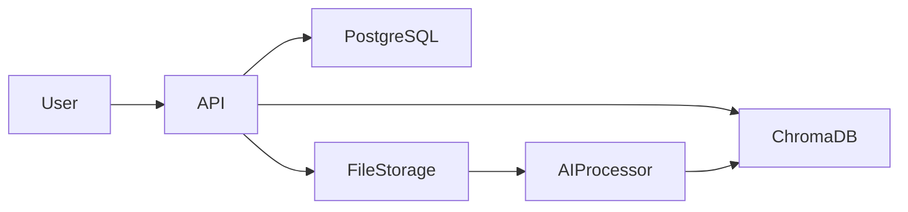
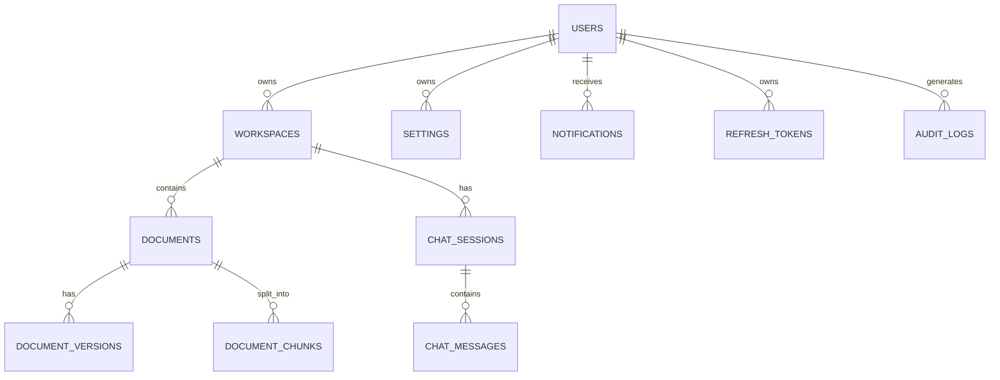

# Database Design

**Project:** AI Document Assistant

**Version:** 1.0

**Document Type:** Database Design Specification

---

# Table of Contents

1. Introduction
2. Database Architecture
3. Database Technologies
4. Entity Relationship Diagram
5. Relational Database Design
6. Table Definitions
7. ChromaDB Design
8. Indexing Strategy
9. Constraints & Validation
10. Data Lifecycle
11. Backup & Recovery
12. Performance Optimization
13. Future Scalability

---

# 1. Introduction

The AI Document Assistant uses a **polyglot persistence architecture**, combining:

- **PostgreSQL** for transactional and relational data
- **ChromaDB** for semantic vector search
- **File Storage** for uploaded documents

This separation allows each storage engine to handle workloads it is optimized for.

---

# 2. Database Architecture



---

# 3. Database Technologies

## PostgreSQL

Purpose:

- User management
- Workspaces
- Documents
- Chat history
- Metadata
- Settings
- Audit logs

Advantages:

- ACID compliance
- JSONB support
- Mature indexing
- Strong consistency

---

## ChromaDB

Purpose:

- Store document embeddings
- Semantic similarity search
- Metadata filtering

Advantages:

- Lightweight
- Open source
- Fast vector retrieval
- Easy LangChain integration

---

# 4. Entity Relationship Diagram



---

# 5. Relational Database Design

## Core Tables

```text
users
workspaces
documents
document_versions
document_chunks
chat_sessions
chat_messages
settings
notifications
refresh_tokens
audit_logs
```

---

# 6. Table Definitions

## users

| Column | Type | Constraint |
|---------|------|------------|
| id | UUID | PK |
| name | VARCHAR(100) | NOT NULL |
| email | VARCHAR(255) | UNIQUE |
| password_hash | TEXT | NOT NULL |
| role | VARCHAR(20) | DEFAULT 'user' |
| created_at | TIMESTAMP | NOT NULL |
| updated_at | TIMESTAMP | NOT NULL |

---

## workspaces

| Column | Type | Constraint |
|---------|------|------------|
| id | UUID | PK |
| user_id | UUID | FK(users.id) |
| name | VARCHAR(255) | NOT NULL |
| description | TEXT | NULL |
| created_at | TIMESTAMP | NOT NULL |

Relationship:

- One User → Many Workspaces

---

## documents

| Column | Type | Constraint |
|---------|------|------------|
| id | UUID | PK |
| workspace_id | UUID | FK |
| file_name | VARCHAR(255) | NOT NULL |
| file_type | VARCHAR(20) | NOT NULL |
| file_size | BIGINT | NOT NULL |
| storage_path | TEXT | NOT NULL |
| upload_status | VARCHAR(20) | DEFAULT 'processing' |
| created_at | TIMESTAMP | NOT NULL |

---

## document_versions

| Column | Type |
|---------|------|
| id | UUID |
| document_id | UUID |
| version | INTEGER |
| created_at | TIMESTAMP |

Purpose:

Maintain document version history.

---

## document_chunks

| Column | Type |
|---------|------|
| id | UUID |
| document_id | UUID |
| page_number | INTEGER |
| chunk_number | INTEGER |
| text | TEXT |
| created_at | TIMESTAMP |

Purpose:

Store metadata for each text chunk. Embeddings are stored separately in ChromaDB.

---

## chat_sessions

| Column | Type |
|---------|------|
| id | UUID |
| workspace_id | UUID |
| title | VARCHAR(255) |
| created_at | TIMESTAMP |

---

## chat_messages

| Column | Type |
|---------|------|
| id | UUID |
| session_id | UUID |
| question | TEXT |
| answer | TEXT |
| model | VARCHAR(100) |
| token_usage | INTEGER |
| response_time_ms | INTEGER |
| created_at | TIMESTAMP |

---

## settings

| Column | Type |
|---------|------|
| id | UUID |
| user_id | UUID |
| theme | VARCHAR(20) |
| language | VARCHAR(10) |
| notifications_enabled | BOOLEAN |

---

## notifications

| Column | Type |
|---------|------|
| id | UUID |
| user_id | UUID |
| title | VARCHAR(255) |
| message | TEXT |
| is_read | BOOLEAN |
| created_at | TIMESTAMP |

---

## refresh_tokens

| Column | Type |
|---------|------|
| id | UUID |
| user_id | UUID |
| token_hash | TEXT |
| expires_at | TIMESTAMP |
| revoked | BOOLEAN |

---

## audit_logs

| Column | Type |
|---------|------|
| id | UUID |
| user_id | UUID |
| action | VARCHAR(100) |
| entity | VARCHAR(50) |
| entity_id | UUID |
| ip_address | VARCHAR(50) |
| created_at | TIMESTAMP |

---

# 7. ChromaDB Design

## Collection

```
documents
```

Each vector record contains:

- Embedding
- Chunk text
- Metadata

---

## Metadata Example

```json
{
  "workspace_id": "ws_001",
  "document_id": "doc_100",
  "page_number": 5,
  "chunk_number": 2,
  "file_name": "Employee_Handbook.pdf",
  "language": "en"
}
```

---

## Vector Structure

```text
Embedding
↓

Metadata
↓

Chunk Text
```

---

# 8. Indexing Strategy

## PostgreSQL Indexes

| Table | Index |
|--------|-------|
| users | email (UNIQUE) |
| workspaces | user_id |
| documents | workspace_id |
| documents | upload_status |
| document_chunks | document_id |
| chat_sessions | workspace_id |
| chat_messages | session_id |
| refresh_tokens | user_id |

---

## Composite Indexes

```sql
(workspace_id, created_at)

(document_id, page_number)

(session_id, created_at)
```

---

## ChromaDB Indexing

Primary lookup fields:

- Workspace ID
- Document ID
- Page Number
- Chunk Number
- Embedding Vector

Similarity Metric:

- Cosine Similarity

---

# 9. Constraints & Validation

## Primary Keys

- UUID for all tables

---

## Foreign Keys

- Workspace → User
- Document → Workspace
- Chunk → Document
- Session → Workspace
- Message → Session

---

## Unique Constraints

- User email
- Workspace name per user (optional)
- Refresh token hash

---

## Validation Rules

- File size limit
- Allowed file types
- Valid email format
- Password policy
- Positive page numbers
- Non-negative token usage

---

# 10. Data Lifecycle

```mermaid
flowchart TD

Upload

↓

Metadata Stored

↓

Document Parsed

↓

Chunks Created

↓

Embeddings Generated

↓

Indexed

↓

Chat Queries

↓

Archive

↓

Delete
```

Deletion removes:

- File
- Metadata
- Chunks
- Embeddings
- Optional chat references

---

# 11. Backup & Recovery

## PostgreSQL

- Daily full backup
- WAL archiving (optional)
- 30-day retention

---

## ChromaDB

- Weekly snapshot
- 14-day retention

---

## File Storage

- Daily incremental backup
- 90-day retention

---

## Recovery Objectives

| Metric | Target |
|---------|--------|
| RPO | 24 Hours |
| RTO | 30 Minutes |

---

# 12. Performance Optimization

Strategies:

- Proper indexing
- Connection pooling
- Query optimization
- Pagination
- Batch inserts
- Background processing
- Compression for large text
- Prepared statements

---

## Query Targets

| Operation | Target |
|-----------|--------|
| Login | <200 ms |
| Document Metadata | <300 ms |
| Chat History | <500 ms |
| Semantic Search | <500 ms |
| Upload Metadata | <300 ms |

---

# 13. Future Scalability

## PostgreSQL

- Read replicas
- Partitioning
- Logical replication
- Connection pooling (PgBouncer)

---

## ChromaDB

Future migration options:

- Qdrant
- Weaviate
- Milvus
- Pinecone

---

## Object Storage

Replace local storage with:

- AWS S3
- Azure Blob Storage
- Google Cloud Storage

---

## Caching

Future Redis cache for:

- User profiles
- Workspace metadata
- Frequently accessed documents
- Search results
- Session data

---

# Database Design Summary

| Layer | Technology |
|--------|------------|
| Relational Database | PostgreSQL |
| Vector Database | ChromaDB |
| File Storage | Local (S3-ready) |
| ORM | SQLAlchemy |
| Migration | Alembic |
| Query Builder | SQLAlchemy ORM |
| Authentication Storage | PostgreSQL |
| Embeddings | ChromaDB |
| Metadata | PostgreSQL |

---

# Best Practices Checklist

- UUID primary keys
- Foreign key constraints
- Indexed search columns
- Soft deletes where appropriate
- Audit logging
- Daily backups
- Connection pooling
- Metadata normalization
- Vector metadata filtering
- Transaction management

---

# Conclusion

The database design separates transactional data from semantic search data, allowing each storage engine to operate efficiently. PostgreSQL manages strongly consistent business data, while ChromaDB enables high-performance vector retrieval for Retrieval-Augmented Generation (RAG). The schema is designed to scale from a local deployment to an enterprise cloud architecture with minimal changes.

---

# End of Database Design Document

**Version:** 1.0

**Status:** Approved for Development