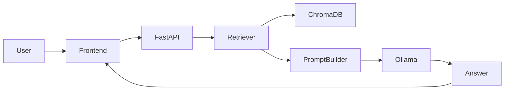
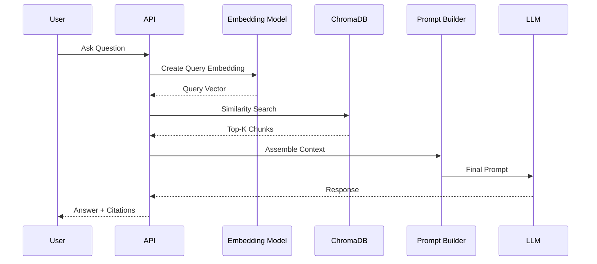

# RAG Architecture

**Project:** AI Document Assistant

**Version:** 1.0

**Document Type:** Retrieval-Augmented Generation (RAG) Architecture Specification

---

# Table of Contents

1. Introduction
2. What is RAG?
3. RAG Goals
4. High-Level Architecture
5. End-to-End Workflow
6. Document Ingestion Pipeline
7. Document Parsing
8. Text Preprocessing
9. Chunking Strategy
10. Embedding Generation
11. Vector Database Architecture
12. Retrieval Pipeline
13. Prompt Construction
14. LLM Response Generation
15. Citation & Source Attribution
16. Conversation Flow
17. Performance Optimization
18. Evaluation Metrics
19. Security & Privacy
20. Future Enhancements

---

# 1. Introduction

Retrieval-Augmented Generation (RAG) combines **semantic search** with **Large Language Models (LLMs)**. Instead of relying only on the model's training data, the application retrieves relevant information from uploaded documents and injects it into the prompt before generating a response.

Benefits:

- Reduced hallucinations
- Answers based on user documents
- Up-to-date knowledge without retraining
- Explainable responses through citations

---

# 2. What is RAG?

Traditional LLM:

```text
Question
   ↓
LLM
   ↓
Answer
```

RAG-based LLM:

```text
Question
   ↓
Retriever
   ↓
Relevant Chunks
   ↓
Prompt Builder
   ↓
LLM
   ↓
Grounded Answer
```

---

# 3. RAG Goals

- Provide accurate answers from uploaded documents
- Preserve document context
- Support multiple file types
- Enable semantic search
- Return citations
- Scale to large document collections
- Keep sensitive documents private

---

# 4. High-Level Architecture



---

# 5. End-to-End Workflow

```mermaid
flowchart TD

Upload Document
    ↓
Parse Document
    ↓
Clean Text
    ↓
Split into Chunks
    ↓
Generate Embeddings
    ↓
Store in ChromaDB
    ↓
User Question
    ↓
Generate Query Embedding
    ↓
Similarity Search
    ↓
Top-K Chunks
    ↓
Build Prompt
    ↓
LLM
    ↓
Answer + Citations
```

---

# 6. Document Ingestion Pipeline

Supported Formats:

- PDF
- DOCX
- TXT
- PPTX
- XLSX
- Markdown

Pipeline:

```text
Upload
 ↓
Validation
 ↓
Storage
 ↓
Parsing
 ↓
Cleaning
 ↓
Chunking
 ↓
Embeddings
 ↓
Indexing
```

Validation checks:

- File size
- MIME type
- Extension
- Virus scan (future)
- Duplicate detection (optional)

---

# 7. Document Parsing

Recommended Libraries:

| Format | Library |
|---------|---------|
| PDF | PyMuPDF |
| DOCX | python-docx |
| PPTX | python-pptx |
| XLSX | openpyxl |
| TXT | Native I/O |
| Images | EasyOCR |

Parser responsibilities:

- Extract text
- Preserve page numbers
- Preserve headings where possible
- Capture metadata
- Detect parsing failures

---

# 8. Text Preprocessing

Before chunking, text is normalized.

Processing steps:

1. Remove unsupported characters
2. Normalize whitespace
3. Preserve paragraphs
4. Preserve headings
5. Detect language
6. Remove empty pages
7. Merge broken lines
8. Normalize Unicode

Example:

Before:

```text
Employee
Handbook

Leave
Policy
```

After:

```text
Employee Handbook

Leave Policy
```

---

# 9. Chunking Strategy

Purpose:

Break long documents into smaller semantic units suitable for embeddings.

Recommended Configuration:

| Setting | Value |
|----------|------:|
| Chunk Size | 800 characters |
| Chunk Overlap | 150 characters |
| Split Strategy | Recursive |

Flow:

```mermaid
flowchart LR

Document
   ↓
Paragraph
   ↓
Section
   ↓
Chunk
```

Chunk Metadata:

- Document ID
- Workspace ID
- Page Number
- Chunk Number
- Section Title
- Source File

---

# 10. Embedding Generation

Purpose:

Convert text into dense vectors for semantic similarity.

Workflow:

```mermaid
flowchart LR

Chunk
   ↓
Embedding Model
   ↓
Vector
   ↓
ChromaDB
```

Recommended Models:

| Model | Dimensions | Notes |
|--------|-----------:|------|
| all-MiniLM-L6-v2 | 384 | Development |
| BAAI/bge-base-en-v1.5 | 768 | Balanced |
| BAAI/bge-large-en-v1.5 | 1024 | High accuracy |

Best Practices:

- Batch embedding generation
- Cache embeddings during processing
- Regenerate embeddings when chunking strategy changes

---

# 11. Vector Database Architecture

Database:

ChromaDB

Collection:

```text
documents
```

Stored Data:

- Embedding vector
- Chunk text
- Metadata

Example Metadata:

```json
{
  "workspace_id": "ws001",
  "document_id": "doc101",
  "page_number": 8,
  "chunk_number": 4,
  "source": "Employee_Handbook.pdf"
}
```

Similarity Metric:

- Cosine Similarity

---

# 12. Retrieval Pipeline

Workflow:



Retrieval Steps:

1. Generate query embedding
2. Search vector database
3. Apply metadata filters
4. Rank by similarity
5. Select Top-K chunks
6. Build prompt

Default Top-K:

```
5
```

---

# 13. Prompt Construction

Prompt Template:

```text
System:
You are an AI assistant. Answer only using the provided context.

Context:
{retrieved_chunks}

Question:
{user_question}

Instructions:
- Do not invent facts.
- Cite document names and page numbers when possible.
- If the answer is not in the context, state that clearly.
```

Guidelines:

- Keep system prompts versioned
- Separate instructions from retrieved context
- Limit prompt length to model context window

---

# 14. LLM Response Generation

Runtime:

Ollama

Supported Models:

- Qwen
- Llama
- Mistral
- Gemma

Generation Flow:

```mermaid
flowchart TD

Prompt
   ↓
LLM
   ↓
Draft Response
   ↓
Post-processing
   ↓
Final Answer
```

Post-processing:

- Remove duplicate citations
- Format markdown
- Validate empty responses
- Add confidence indicators (future)

---

# 15. Citation & Source Attribution

Each retrieved chunk includes:

- File name
- Page number
- Chunk number

Example Response:

```text
Employees are entitled to 20 days of annual leave.

Sources:
- Employee_Handbook.pdf (Page 12)
- HR_Policy.pdf (Page 4)
```

Benefits:

- Transparency
- User trust
- Easier verification

---

# 16. Conversation Flow

Chat Session:

```mermaid
flowchart TD

Question
   ↓
Retrieve Context
   ↓
Generate Answer
   ↓
Store History
   ↓
Follow-up Question
```

Future Enhancements:

- Conversation memory
- Context summarization
- Multi-turn retrieval optimization

---

# 17. Performance Optimization

Techniques:

- Batch embeddings
- Async document processing
- Metadata filtering before retrieval
- Pagination for large workspaces
- Prompt size limits
- Lazy loading chat history
- Response streaming (future)

Performance Targets:

| Operation | Target |
|-----------|--------|
| Query Embedding | <150 ms |
| Vector Search | <300 ms |
| Prompt Build | <100 ms |
| LLM Generation | <3 s |
| Total Chat Response | <4 s |

---

# 18. Evaluation Metrics

Retrieval Metrics:

- Precision@K
- Recall@K
- Mean Reciprocal Rank (MRR)
- Hit Rate

Generation Metrics:

- Groundedness
- Hallucination Rate
- Citation Accuracy
- Response Relevance
- User Satisfaction

Operational Metrics:

- Average response time
- Embedding throughput
- Indexing duration
- Retrieval latency

---

# 19. Security & Privacy

Measures:

- Workspace isolation
- Metadata filtering
- JWT-protected APIs
- Local LLM execution
- No document leakage across users
- Secure file storage
- Audit logging

Future:

- Encryption at rest
- Field-level encryption
- Role-based retrieval
- Data masking for sensitive content

---

# 20. Future Enhancements

### Retrieval

- Hybrid Search (BM25 + Vector)
- Cross-Encoder Re-ranking
- Query Expansion
- Multi-vector Retrieval

### AI

- Multi-agent workflows
- Tool calling
- Structured output
- Function calling

### Vector Database

- Qdrant clustering
- Weaviate
- Milvus
- Pinecone

### Knowledge Management

- Automatic document summarization
- Knowledge graph generation
- Duplicate detection
- Incremental indexing

---

# RAG Technology Summary

| Layer | Technology |
|--------|------------|
| Parsing | PyMuPDF, python-docx |
| OCR | EasyOCR |
| Chunking | LangChain Text Splitters |
| Embeddings | Hugging Face Models |
| Vector Database | ChromaDB |
| Retrieval | LangChain Retriever |
| Prompt Builder | LangChain |
| LLM Runtime | Ollama |
| Models | Qwen, Llama, Mistral, Gemma |

---

# Best Practices Checklist

- Recursive chunking
- Metadata-rich embeddings
- Cosine similarity search
- Prompt versioning
- Citation support
- Workspace isolation
- Async ingestion
- Batch embeddings
- Retrieval evaluation
- Secure local inference

---

# Conclusion

The RAG architecture enables the AI Document Assistant to deliver accurate, explainable, and context-aware responses. By separating document ingestion, semantic indexing, retrieval, prompt construction, and LLM generation into modular stages, the system remains scalable, maintainable, and adaptable to future AI advancements.

---

# End of RAG Architecture Document

**Version:** 1.0

**Status:** Approved for Development