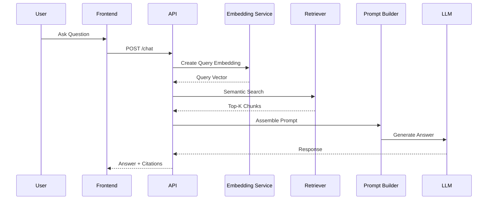

# AI Workflow

**Project:** AI Document Assistant

**Version:** 1.0

**Document Type:** AI Workflow Specification

---

# Table of Contents

1. Introduction
2. AI Workflow Overview
3. AI Components
4. End-to-End AI Lifecycle
5. Document Processing Workflow
6. Query Processing Workflow
7. LangChain Orchestration
8. Prompt Engineering
9. Context Management
10. Conversation Memory
11. Model Management
12. Token Management
13. Streaming Responses
14. Error Handling & Recovery
15. AI Safety Guardrails
16. Performance Optimization
17. Monitoring & Observability
18. Future Enhancements

---

# 1. Introduction

The AI Workflow defines how the AI subsystem processes documents, retrieves knowledge, constructs prompts, interacts with the Large Language Model (LLM), and delivers grounded responses to users.

The workflow is designed around:

- Retrieval-Augmented Generation (RAG)
- Modular AI services
- Local LLM execution
- Explainable responses
- Scalable orchestration

---

# 2. AI Workflow Overview

```mermaid
flowchart TD

User Question
    ↓
API
    ↓
Query Embedding
    ↓
Vector Search
    ↓
Context Retrieval
    ↓
Prompt Builder
    ↓
LLM
    ↓
Post Processing
    ↓
Answer + Citations
```

---

# 3. AI Components

| Component | Responsibility |
|-----------|----------------|
| Document Parser | Extract text |
| OCR Engine | Read scanned documents |
| Text Cleaner | Normalize extracted text |
| Chunker | Split text |
| Embedding Service | Generate vectors |
| Vector Store | Store embeddings |
| Retriever | Find relevant chunks |
| Prompt Builder | Assemble final prompt |
| LLM Client | Call Ollama |
| Response Formatter | Format output |
| Citation Generator | Add sources |

---

# 4. End-to-End AI Lifecycle

```mermaid
flowchart TD

Upload Document
    ↓
Parse
    ↓
Clean
    ↓
Chunk
    ↓
Embed
    ↓
Store
    ↓
User Query
    ↓
Retrieve
    ↓
Prompt
    ↓
LLM
    ↓
Answer
```

Two independent workflows exist:

- **Offline workflow:** Document ingestion and indexing.
- **Online workflow:** User query and response generation.

---

# 5. Document Processing Workflow

## Step 1 — Upload

User uploads a supported document.

Supported formats:

- PDF
- DOCX
- TXT
- PPTX
- XLSX
- Markdown

---

## Step 2 — Validation

Checks include:

- File extension
- MIME type
- Maximum size
- Empty file detection
- Duplicate detection (optional)

---

## Step 3 — Parsing

Extract text while preserving:

- Page numbers
- Paragraphs
- Headings
- Tables (where possible)

---

## Step 4 — Cleaning

Operations:

- Normalize whitespace
- Remove control characters
- Merge broken lines
- Normalize Unicode
- Remove empty pages

---

## Step 5 — Chunking

Configuration:

- Chunk size: 800 characters
- Overlap: 150 characters

Each chunk contains:

- Chunk ID
- Document ID
- Workspace ID
- Page number
- Text

---

## Step 6 — Embedding

Each chunk is transformed into a dense vector using a Hugging Face embedding model.

---

## Step 7 — Indexing

Embeddings and metadata are stored in ChromaDB.

---

# 6. Query Processing Workflow



---

# 7. LangChain Orchestration

LangChain coordinates the RAG pipeline.

Responsibilities:

- Load documents
- Split text
- Generate embeddings
- Connect to ChromaDB
- Retrieve context
- Build prompts
- Invoke the LLM

Logical flow:

```text
Loader
   ↓
Splitter
   ↓
Embeddings
   ↓
Vector Store
   ↓
Retriever
   ↓
Prompt Template
   ↓
LLM
```

---

# 8. Prompt Engineering

## Prompt Structure

```text
System:
You are an AI document assistant.

Context:
{retrieved_context}

Question:
{user_question}

Rules:
- Answer only from the provided context.
- Do not invent facts.
- Cite document names and page numbers.
- If the answer is unavailable, clearly state that.
```

### Prompt Design Principles

- Separate instructions from context
- Keep prompts deterministic
- Limit prompt size
- Version prompt templates
- Preserve citations

---

# 9. Context Management

Context consists of the retrieved document chunks.

Selection strategy:

- Top-K semantic matches
- Metadata filtering
- Workspace isolation
- Optional score threshold

Typical configuration:

| Parameter | Value |
|-----------|------:|
| Top-K | 5 |
| Similarity Metric | Cosine |
| Chunk Overlap | 150 |
| Max Context Length | Model dependent |

---

# 10. Conversation Memory

Current MVP:

- Chat history stored in PostgreSQL
- Each request retrieves only relevant document context

Future enhancements:

- Conversation summarization
- Long-term memory
- Session context compression
- Memory pruning

---

# 11. Model Management

Runtime:

- Ollama

Supported Models:

| Model | Use Case |
|--------|----------|
| Qwen | General QA |
| Llama | Balanced performance |
| Mistral | Fast inference |
| Gemma | Lightweight deployments |

Selection criteria:

- Context window
- Latency
- Hardware requirements
- Accuracy
- Licensing

---

# 12. Token Management

Token budget is limited by the model context window.

Typical allocation:

| Section | Approx. Tokens |
|---------|---------------:|
| System Prompt | 200 |
| Retrieved Context | 2,500 |
| User Question | 150 |
| Response Budget | 1,000 |

Strategies:

- Truncate long contexts
- Prioritize high-scoring chunks
- Remove duplicate content

---

# 13. Streaming Responses

Future implementation:

```mermaid
flowchart LR

LLM --> Token Stream --> API --> Frontend --> User
```

Benefits:

- Lower perceived latency
- Better user experience
- Progressive rendering

---

# 14. Error Handling & Recovery

Possible failures:

| Failure | Recovery |
|----------|----------|
| Parsing error | Retry / notify user |
| OCR failure | Skip OCR or retry |
| Embedding failure | Retry batch |
| Vector DB unavailable | Return service unavailable |
| LLM timeout | Retry once, then fallback |
| Empty retrieval | Inform user no relevant content was found |

Fallback message:

> "I couldn't find enough relevant information in the uploaded documents to answer this question."

---

# 15. AI Safety Guardrails

Safety principles:

- Answer only from retrieved context
- Avoid hallucinations
- Respect workspace boundaries
- Do not expose hidden prompts
- Reject unsupported file references

Future additions:

- Prompt injection detection
- Toxicity filtering
- PII masking
- Content moderation

---

# 16. Performance Optimization

Techniques:

- Batch embedding generation
- Asynchronous ingestion
- Metadata filtering
- Cached prompt templates
- Parallel retrieval and formatting
- Response streaming

Performance targets:

| Operation | Target |
|-----------|--------|
| Query Embedding | <150 ms |
| Vector Search | <300 ms |
| Prompt Build | <100 ms |
| LLM Generation | <3 s |
| Total Response | <4 s |

---

# 17. Monitoring & Observability

Metrics:

- Document ingestion time
- Embedding throughput
- Retrieval latency
- Prompt size
- Token usage
- LLM response time
- Citation count
- Error rate

Logs:

- Prompt version
- Model used
- Retrieval score
- Response duration
- Failure reason

Future integration:

- Prometheus
- Grafana
- OpenTelemetry

---

# 18. Future Enhancements

### Retrieval

- Hybrid Search (BM25 + Vector)
- Cross-Encoder Re-ranking
- Query Expansion

### AI

- Multi-agent workflows
- Function calling
- Tool usage
- Structured outputs

### Memory

- Persistent conversation memory
- Personalized knowledge retrieval
- Semantic chat history search

### Optimization

- Dynamic chunk sizing
- Adaptive Top-K retrieval
- Automatic prompt compression
- Multi-model routing

---

# AI Workflow Summary

| Stage | Technology |
|--------|------------|
| Parsing | PyMuPDF |
| OCR | EasyOCR |
| Chunking | LangChain |
| Embeddings | Hugging Face |
| Vector Store | ChromaDB |
| Retrieval | LangChain Retriever |
| Prompting | Prompt Templates |
| LLM Runtime | Ollama |
| Response Formatting | FastAPI Service |

---

# Best Practices Checklist

- Modular AI services
- Metadata-rich retrieval
- Versioned prompt templates
- Workspace isolation
- Local LLM execution
- Batch embeddings
- Async processing
- Citation support
- Streaming-ready architecture
- Comprehensive monitoring

---

# Conclusion

The AI Workflow provides a structured, modular, and scalable approach for integrating Retrieval-Augmented Generation into the AI Document Assistant. By separating ingestion, retrieval, prompt construction, generation, and post-processing, the system achieves high accuracy, explainability, and maintainability while remaining flexible enough to support future AI capabilities.

---

# End of AI Workflow Document

**Version:** 1.0

**Status:** Approved for Development
