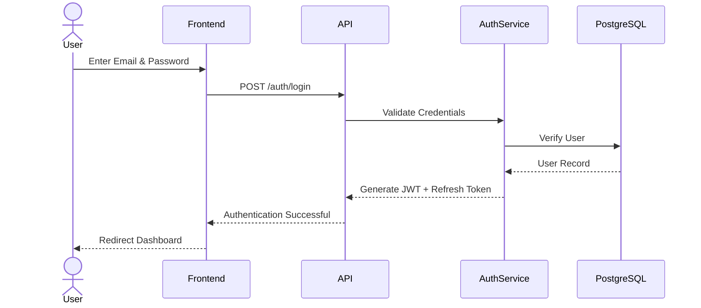
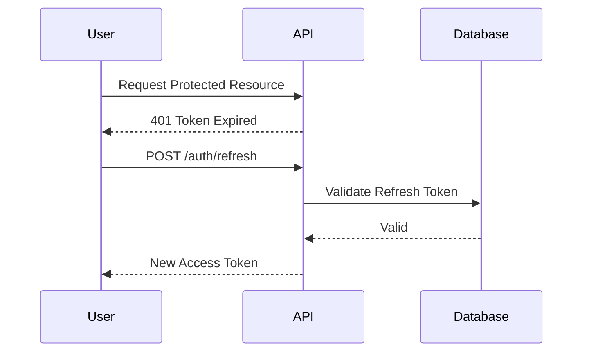

# Authentication & Authorization

**Project:** AI Document Assistant

**Version:** 1.0

**Document Type:** Authentication & Authorization Specification

---

# Table of Contents

1. Introduction
2. Security Goals
3. Authentication Architecture
4. Authentication Flow
5. User Registration
6. Login Process
7. JWT Architecture
8. Refresh Token Flow
9. Authorization (RBAC)
10. Session Management
11. Password Security
12. API Security
13. Middleware
14. Threat Model
15. Monitoring & Auditing
16. Future Enhancements

---

# 1. Introduction

Authentication verifies **who a user is**, while authorization determines **what a user is allowed to do**.

The AI Document Assistant uses:

- JWT Access Tokens
- Refresh Tokens
- Role-Based Access Control (RBAC)
- Secure password hashing
- HTTPS communication

---

# 2. Security Goals

The authentication system should:

- Verify user identity
- Protect user data
- Prevent unauthorized access
- Support stateless APIs
- Enable secure session renewal
- Provide auditability
- Scale horizontally

---

# 3. Authentication Architecture

```mermaid
flowchart LR

User --> Frontend

Frontend --> FastAPI

FastAPI --> AuthService

AuthService --> PostgreSQL

AuthService --> JWT

JWT --> Protected APIs
```

---

# 4. Authentication Flow



---

# 5. User Registration

Endpoint:

```text
POST /api/v1/auth/register
```

Validation Rules:

- Name required
- Valid email format
- Unique email
- Strong password
- Password confirmation

Password Policy:

- Minimum 8 characters
- At least one uppercase letter
- At least one lowercase letter
- At least one digit
- At least one special character

Example Request:

```json
{
  "name": "Jane Doe",
  "email": "jane@example.com",
  "password": "StrongPass123!"
}
```

---

# 6. Login Process

Endpoint:

```text
POST /api/v1/auth/login
```

Steps:

1. Validate request
2. Find user by email
3. Verify password hash
4. Generate access token
5. Generate refresh token
6. Store hashed refresh token
7. Return tokens

Example Response:

```json
{
  "access_token": "<jwt>",
  "refresh_token": "<token>",
  "token_type": "Bearer",
  "expires_in": 900
}
```

---

# 7. JWT Architecture

Purpose:

Provide stateless authentication.

Header:

```json
{
  "alg": "HS256",
  "typ": "JWT"
}
```

Payload:

```json
{
  "sub": "user_uuid",
  "email": "jane@example.com",
  "role": "user",
  "iat": 1700000000,
  "exp": 1700000900
}
```

Signature:

```
HMAC SHA-256
```

Recommended Lifetime:

| Token | Lifetime |
|--------|----------|
| Access Token | 15 minutes |
| Refresh Token | 7 days |

---

# 8. Refresh Token Flow



Recommendations:

- Store refresh token hash in PostgreSQL
- Rotate refresh tokens after use
- Revoke compromised tokens
- Use HTTP-only, Secure cookies in production

---

# 9. Authorization (RBAC)

Roles:

| Role | Permissions |
|------|-------------|
| Guest | Public endpoints only |
| User | Manage own workspaces and documents |
| Admin | Manage users, audit logs, system health |

Authorization Matrix:

| Resource | Guest | User | Admin |
|----------|:-----:|:----:|:-----:|
| Login | ✔ | ✔ | ✔ |
| Upload Document | ✖ | ✔ | ✔ |
| AI Chat | ✖ | ✔ | ✔ |
| Manage Users | ✖ | ✖ | ✔ |
| View Audit Logs | ✖ | ✖ | ✔ |

---

# 10. Session Management

The backend is stateless.

Session state consists of:

- Access Token
- Refresh Token
- User Profile

Recommendations:

- Access token stored in memory
- Refresh token stored in HTTP-only cookie
- Automatic refresh before expiration
- Logout revokes refresh token

---

# 11. Password Security

Hashing Algorithm:

```
bcrypt
```

Best Practices:

- Never store plain-text passwords
- Use a strong work factor
- Enforce password complexity
- Support password reset
- Prevent password reuse (future)

Forgot Password Flow:

1. User requests reset
2. Generate secure reset token
3. Email reset link
4. Validate token
5. Set new password
6. Invalidate old sessions

---

# 12. API Security

Every protected request includes:

```http
Authorization: Bearer <access_token>
```

Security Measures:

- HTTPS only
- JWT validation
- Role checks
- Input validation
- File validation
- Request size limits
- Secure headers

---

# 13. Middleware

Authentication middleware responsibilities:

- Validate JWT
- Load user context
- Reject invalid tokens
- Enforce RBAC
- Log security events

Request Flow:

```mermaid
flowchart TD

Request
   ↓
CORS
   ↓
JWT Validation
   ↓
Role Check
   ↓
Route Handler
   ↓
Response
```

---

# 14. Threat Model

| Threat | Mitigation |
|---------|------------|
| Brute Force | Rate limiting, account lockout (future) |
| Password Theft | bcrypt hashing |
| Token Theft | HTTPS, Secure cookies |
| Replay Attack | Token expiration, rotation |
| XSS | Escape output, Content Security Policy |
| CSRF | HTTP-only cookies, CSRF tokens (future) |
| SQL Injection | SQLAlchemy ORM, parameterized queries |
| Prompt Injection | Prompt validation and context isolation |

---

# 15. Monitoring & Auditing

Log Events:

- Registration
- Login success
- Login failure
- Password change
- Password reset
- Token refresh
- Logout
- Permission denied

Audit Log Fields:

- User ID
- Action
- Timestamp
- IP address
- User agent
- Outcome

Security Metrics:

| Metric | Purpose |
|---------|---------|
| Failed logins | Detect attacks |
| Token refresh count | Session analysis |
| Active users | Usage monitoring |
| Permission denials | Security review |

---

# 16. Future Enhancements

Authentication:

- Multi-Factor Authentication (MFA)
- Passwordless login
- Magic links
- Biometric authentication (mobile)

Authorization:

- Fine-grained permissions
- Attribute-Based Access Control (ABAC)
- Organization-level roles

Identity Providers:

- OAuth2
- OpenID Connect
- Google Sign-In
- Microsoft Entra ID
- GitHub Login

Security:

- Device management
- Session revocation dashboard
- Suspicious login detection
- Risk-based authentication

---

# Authentication Technology Summary

| Component | Technology |
|-----------|------------|
| Authentication | JWT |
| Password Hashing | bcrypt |
| Authorization | RBAC |
| Transport Security | HTTPS / TLS 1.3 |
| Token Storage | HTTP-only Cookies (recommended) |
| Framework | FastAPI Security |
| Database | PostgreSQL |
| ORM | SQLAlchemy |

---

# Authentication Checklist

- JWT authentication
- Refresh token rotation
- Secure password hashing
- Role-based authorization
- HTTPS enforcement
- Input validation
- Rate limiting
- Audit logging
- Session revocation
- Password reset flow
- Secure cookie usage
- Future OAuth2 support

---

# Conclusion

The authentication and authorization architecture provides a secure, scalable, and maintainable identity layer for the AI Document Assistant. By combining JWT-based authentication, refresh token rotation, RBAC, strong password security, and comprehensive auditing, the system supports both current requirements and future enterprise-grade enhancements.

---

# End of Authentication Document

**Version:** 1.0

**Status:** Approved for Development