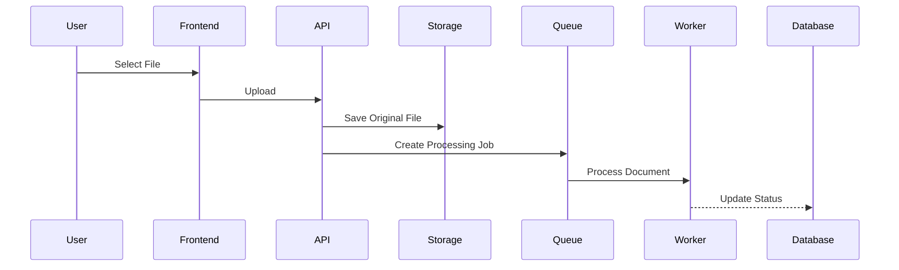
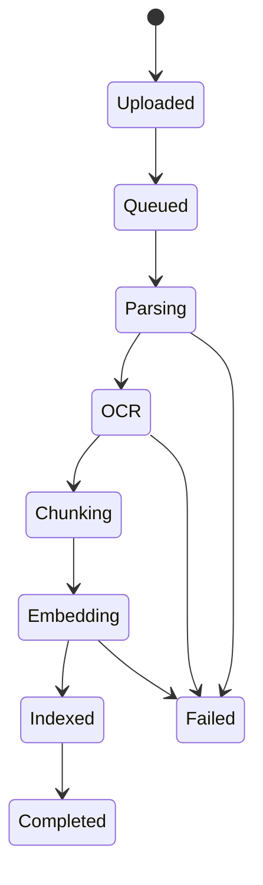

# Document Processing

**Project:** AI Document Assistant

**Version:** 1.0

**Document Type:** Document Processing Specification

---

# Table of Contents

1. Introduction
2. Processing Objectives
3. Processing Architecture
4. Supported File Types
5. Upload Workflow
6. File Validation
7. Storage Strategy
8. Document Parsing
9. OCR Processing
10. Text Preprocessing
11. Metadata Extraction
12. Chunking Strategy
13. Embedding Generation
14. Vector Storage
15. Processing Status Lifecycle
16. Background Processing
17. Error Handling
18. Performance Optimization
19. Monitoring
20. Future Enhancements

---

# 1. Introduction

The Document Processing subsystem converts uploaded files into AI-searchable knowledge.

The pipeline performs:

- File upload
- Validation
- Storage
- Text extraction
- OCR (when required)
- Text cleaning
- Metadata extraction
- Chunk generation
- Embedding creation
- Vector indexing

The output is optimized for Retrieval-Augmented Generation (RAG).

---

# 2. Processing Objectives

Goals:

- Support multiple document formats
- Preserve document structure
- Produce high-quality embeddings
- Enable semantic search
- Maintain document traceability
- Process large files efficiently
- Recover gracefully from failures

---

# 3. Processing Architecture

```mermaid
flowchart TD

Upload
    ↓
Validation
    ↓
Storage
    ↓
Parser
    ↓
OCR
    ↓
Text Cleaning
    ↓
Metadata Extraction
    ↓
Chunking
    ↓
Embeddings
    ↓
ChromaDB
```

---

# 4. Supported File Types

| Format | Extension | Parser |
|---------|-----------|--------|
| PDF | .pdf | PyMuPDF |
| Word | .docx | python-docx |
| Text | .txt | Native |
| Markdown | .md | Markdown Parser |
| PowerPoint | .pptx | python-pptx |
| Excel | .xlsx | openpyxl |

Maximum upload size (recommended):

```
100 MB
```

Future formats:

- HTML
- CSV
- EPUB
- JSON
- XML

---

# 5. Upload Workflow



Steps:

1. Upload file
2. Validate request
3. Store original file
4. Create database record
5. Queue processing job
6. Notify user

---

# 6. File Validation

Validation includes:

### File Type

Allowed extensions only.

### MIME Type

Verify actual file type.

### File Size

Reject oversized files.

### Duplicate Detection

Optional hash comparison.

### Virus Scanning (Future)

Integrate malware scanner before processing.

Validation Errors:

| Error | Description |
|--------|-------------|
| Unsupported Format | Invalid extension |
| File Too Large | Exceeds size limit |
| Corrupted File | Cannot be opened |
| Empty File | No content detected |

---

# 7. Storage Strategy

Original documents are preserved.

Directory layout:

```text
storage/

workspace_id/

document_id/

original.pdf
```

Recommendations:

- Immutable originals
- UUID filenames
- Metadata stored in PostgreSQL
- Binary files outside database

---

# 8. Document Parsing

Purpose:

Extract machine-readable text.

Parser Selection:

| File | Library |
|------|----------|
| PDF | PyMuPDF |
| DOCX | python-docx |
| PPTX | python-pptx |
| XLSX | openpyxl |
| TXT | Native |
| MD | markdown-it |

Extracted elements:

- Text
- Paragraphs
- Headings
- Page numbers
- Tables (basic)
- Hyperlinks (optional)

---

# 9. OCR Processing

OCR is used when:

- PDF contains scanned pages
- Images contain text
- Parser extracts insufficient text

OCR Engine:

```
EasyOCR
```

Workflow:

```mermaid
flowchart TD

Image
    ↓
OCR
    ↓
Text
    ↓
Merge
```

Supported image types:

- PNG
- JPG
- JPEG
- TIFF

Future:

- Multi-language OCR
- Layout-aware OCR

---

# 10. Text Preprocessing

Operations:

- Unicode normalization
- Remove control characters
- Merge broken lines
- Normalize whitespace
- Remove duplicate spaces
- Standardize quotation marks

Optional:

- Stopword removal
- Lemmatization
- Language detection

---

# 11. Metadata Extraction

Document-level metadata:

- Document ID
- Workspace ID
- Filename
- File type
- File size
- Upload timestamp
- Uploaded by

Chunk-level metadata:

- Chunk ID
- Page number
- Section heading
- Character offset
- Source document

Metadata Example:

```json
{
  "document_id": "...",
  "page": 8,
  "section": "Leave Policy",
  "chunk": 14
}
```

---

# 12. Chunking Strategy

Purpose:

Divide text into retrieval-friendly segments.

Recommended configuration:

| Parameter | Value |
|-----------|------:|
| Chunk Size | 800 characters |
| Overlap | 150 characters |

Algorithm:

```
RecursiveCharacterTextSplitter
```

Chunk Structure:

```json
{
  "chunk_id": "...",
  "text": "...",
  "page": 5,
  "metadata": {}
}
```

Benefits:

- Better retrieval accuracy
- Reduced context overflow
- Improved semantic matching

---

# 13. Embedding Generation

Purpose:

Convert chunks into dense vectors.

Model:

```
BAAI/bge-base-en-v1.5
```

Alternatives:

- all-MiniLM-L6-v2
- bge-large-en-v1.5
- e5-base-v2

Workflow:

```mermaid
flowchart TD

Chunk
    ↓
Embedding Model
    ↓
Vector
```

Best Practices:

- Batch processing
- GPU acceleration (optional)
- Retry failed batches

---

# 14. Vector Storage

Database:

```
ChromaDB
```

Stored Data:

- Embedding vector
- Chunk text
- Metadata
- Document ID
- Workspace ID

Retrieval Index:

- Cosine similarity

Collection Example:

```text
workspace_vectors
```

---

# 15. Processing Status Lifecycle



Status Values:

- Uploaded
- Queued
- Parsing
- OCR
- Chunking
- Embedding
- Indexed
- Completed
- Failed

---

# 16. Background Processing

Long-running tasks execute asynchronously.

Suggested worker:

- Celery
- RQ
- Dramatiq
- FastAPI BackgroundTasks (MVP)

Tasks:

- Parsing
- OCR
- Embeddings
- Reprocessing

Advantages:

- Faster API responses
- Better scalability
- Retry support

---

# 17. Error Handling

Failure Scenarios:

| Failure | Recovery |
|----------|----------|
| Parser failure | Retry or alternate parser |
| OCR failure | Skip OCR if text exists |
| Embedding timeout | Retry batch |
| Storage failure | Rollback transaction |
| Corrupt file | Mark as failed |

User Notification:

- Processing failed
- Retry available
- Failure reason logged

---

# 18. Performance Optimization

Strategies:

- Asynchronous workers
- Batch embeddings
- Parallel page parsing
- Incremental indexing
- Cached parser instances
- Lazy metadata extraction

Performance Targets:

| Operation | Target |
|-----------|--------|
| Upload | <2 s |
| Validation | <100 ms |
| Parsing | <5 s (50-page PDF) |
| OCR | <10 s (10 pages) |
| Embedding | <3 s |
| Indexing | <2 s |

---

# 19. Monitoring

Metrics:

- Upload count
- Processing duration
- OCR usage
- Parser failures
- Embedding throughput
- Queue length
- Average chunk count
- Average processing time

Logs:

- Document ID
- Processing stage
- Worker ID
- Duration
- Error message
- Retry count

Dashboards:

- Active jobs
- Failed jobs
- Average latency
- Success rate

---

# 20. Future Enhancements

Parsing:

- Table extraction
- Image captions
- Footnotes
- Header/footer detection

Chunking:

- Semantic chunking
- Section-aware chunking
- Adaptive chunk sizes

Embeddings:

- Multilingual models
- Domain-specific embeddings
- Incremental updates

Processing:

- Distributed workers
- GPU inference
- Real-time progress updates
- Automatic language detection

---

# Technology Summary

| Component | Technology |
|-----------|------------|
| API | FastAPI |
| PDF Parsing | PyMuPDF |
| DOCX Parsing | python-docx |
| PPTX Parsing | python-pptx |
| XLSX Parsing | openpyxl |
| OCR | EasyOCR |
| Chunking | LangChain |
| Embeddings | Hugging Face |
| Vector Store | ChromaDB |
| Database | PostgreSQL |
| Background Jobs | Celery / RQ / Dramatiq |

---

# Processing Checklist

- File validation
- Original file preservation
- Text extraction
- OCR fallback
- Metadata extraction
- Recursive chunking
- Embedding generation
- Vector indexing
- Background processing
- Error recovery
- Monitoring
- Audit logging

---

# Conclusion

The Document Processing subsystem transforms uploaded files into structured, searchable knowledge suitable for AI-assisted retrieval. By combining robust validation, reliable parsing, OCR support, optimized chunking, embedding generation, and vector indexing, the system delivers high-quality data for accurate Retrieval-Augmented Generation while remaining scalable and maintainable.

---

# End of Document Processing Specification

**Version:** 1.0

**Status:** Approved for Development