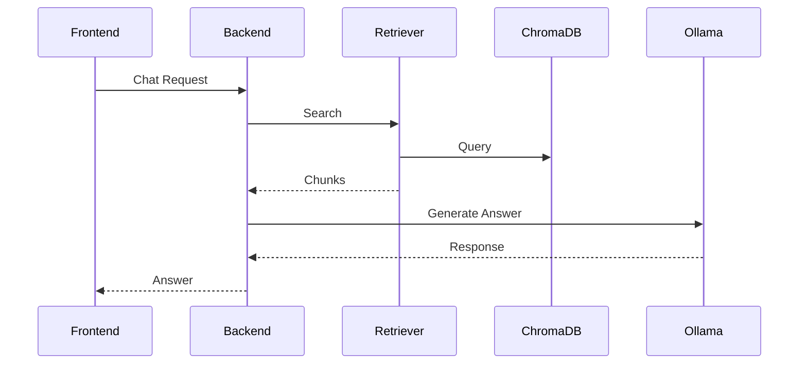

# Monitoring & Logging

**Project:** AI Document Assistant

**Version:** 1.0

**Document Type:** Monitoring & Logging Architecture

**Status:** Approved for Production

---

# Table of Contents

1. Introduction
2. Observability Goals
3. Observability Architecture
4. Logging Architecture
5. Metrics Collection
6. Distributed Tracing
7. Health Checks
8. AI Observability
9. Database Monitoring
10. Infrastructure Monitoring
11. Alerting
12. Dashboards
13. Log Retention
14. Incident Response
15. Capacity Planning
16. SLA / SLO / SLI
17. Disaster Monitoring
18. Future Enhancements

---

# 1. Introduction

The Monitoring & Logging subsystem provides complete visibility into the health, performance, reliability, and security of the AI Document Assistant.

It enables engineers to:

- Detect failures
- Diagnose issues
- Monitor AI quality
- Measure performance
- Plan capacity
- Improve reliability

---

# 2. Observability Goals

The platform should provide visibility into:

- User activity
- API performance
- Document processing
- AI inference
- RAG retrieval
- Infrastructure
- Databases
- Security events

Three pillars of observability:

- Logs
- Metrics
- Traces

---

# 3. Observability Architecture

```mermaid
flowchart LR

Application

↓

Structured Logs

↓

Loki

↓

Grafana

Application

↓

Metrics

↓

Prometheus

↓

Grafana

Application

↓

Traces

↓

OpenTelemetry

↓

Jaeger

Infrastructure

↓

Node Exporter

↓

Prometheus
```

Technology Stack:

| Component | Technology |
|----------|------------|
| Metrics | Prometheus |
| Dashboards | Grafana |
| Logs | Loki |
| Traces | OpenTelemetry + Jaeger |
| Infrastructure | Node Exporter |
| Container Metrics | cAdvisor |

---

# 4. Logging Architecture

All services emit **structured JSON logs**.

Log Levels:

- DEBUG
- INFO
- WARNING
- ERROR
- CRITICAL

Example:

```json
{
  "timestamp":"2026-07-19T10:30:00Z",
  "service":"backend",
  "level":"INFO",
  "request_id":"abc123",
  "user_id":"u-001",
  "workspace_id":"w-101",
  "message":"Document uploaded"
}
```

Required Fields:

- Timestamp
- Request ID
- User ID
- Workspace ID
- Service Name
- Log Level
- Event Type
- Duration

---

# 5. Metrics Collection

Application Metrics:

- Request count
- Request duration
- Error rate
- Active users
- Upload count
- Chat requests
- Search requests

Document Metrics:

- Uploaded documents
- Processing failures
- Average processing time
- OCR usage
- Chunk count
- Embedding throughput

Example Prometheus Metric:

```text
http_requests_total

document_processing_seconds

chat_requests_total

embedding_generation_seconds
```

---

# 6. Distributed Tracing

Purpose:

Track requests across multiple services.

Trace Flow:



Trace Metadata:

- Trace ID
- Span ID
- Parent Span
- Duration
- Service Name

---

# 7. Health Checks

Health Endpoints:

```text
GET /health

GET /ready

GET /live
```

Health Components:

- Backend
- PostgreSQL
- ChromaDB
- Ollama
- File Storage

Example Response:

```json
{
  "status":"healthy",
  "services":{
    "database":"up",
    "chromadb":"up",
    "ollama":"up"
  }
}
```

---

# 8. AI Observability

Monitor AI-specific metrics:

Retrieval:

- Retrieval latency
- Top-K score
- Average similarity
- Empty retrieval rate

Generation:

- LLM response time
- Tokens in
- Tokens out
- Prompt size
- Context size

Quality:

- Citation count
- Groundedness score
- Hallucination rate
- Answer success rate

Model Metrics:

| Metric | Target |
|----------|---------|
| Retrieval Time | <300 ms |
| LLM Generation | <3 s |
| Hallucination Rate | <5% |
| Grounded Answers | >95% |

---

# 9. Database Monitoring

PostgreSQL:

- Connections
- Slow queries
- Transactions
- Locks
- Replication lag (future)

ChromaDB:

- Collection count
- Vector count
- Query latency
- Index size
- Memory usage

Storage:

- Disk usage
- Backup status
- Growth rate

---

# 10. Infrastructure Monitoring

Monitor:

- CPU
- Memory
- Disk
- Network
- Containers
- Pods
- Nodes

Container Metrics:

- CPU usage
- Memory usage
- Restarts
- OOM kills

Kubernetes Metrics:

- Pod health
- Deployment status
- Replica count
- Node utilization

---

# 11. Alerting

Alert Severity:

| Level | Description |
|--------|-------------|
| Info | Informational |
| Warning | Requires attention |
| Critical | Immediate action |

Alert Examples:

- API latency > 2 seconds
- Error rate > 5%
- PostgreSQL unavailable
- ChromaDB unavailable
- Ollama unavailable
- Disk usage > 85%
- CPU > 90%
- Memory > 90%
- Failed AI requests > 10%

Notification Channels:

- Email
- Slack
- Microsoft Teams
- PagerDuty (future)

---

# 12. Dashboards

## Executive Dashboard

Displays:

- Active users
- System uptime
- API health
- AI requests
- Error rate

---

## API Dashboard

Metrics:

- Requests/sec
- Latency
- Error rate
- Top endpoints

---

## AI Dashboard

Metrics:

- Chat volume
- Retrieval latency
- Prompt size
- Token usage
- Hallucination rate
- Citation count

---

## Infrastructure Dashboard

Metrics:

- CPU
- RAM
- Disk
- Network
- Containers

---

# 13. Log Retention

Retention Policy:

| Log Type | Retention |
|-----------|-----------|
| Application | 90 days |
| Audit | 1 year |
| Security | 1 year |
| Error | 180 days |
| Debug | 7 days |

Archive:

- Compressed
- Encrypted
- Immutable (recommended)

---

# 14. Incident Response

Workflow:

```text
Alert

↓

Detection

↓

Investigation

↓

Containment

↓

Resolution

↓

Root Cause Analysis

↓

Postmortem
```

Incident Data:

- Timeline
- Impact
- Root cause
- Resolution
- Preventive actions

---

# 15. Capacity Planning

Track:

- Storage growth
- Vector growth
- User growth
- API traffic
- AI requests/day

Thresholds:

- Storage > 80%
- CPU > 75%
- Memory > 75%
- Queue length > 100

Scaling Triggers:

- Increase backend replicas
- Add database resources
- Expand storage
- Deploy GPU inference nodes

---

# 16. SLA / SLO / SLI

Service Level Indicators (SLI):

- Availability
- Latency
- Error rate
- AI response time

Service Level Objectives (SLO):

| Metric | Target |
|----------|--------|
| Availability | 99.9% |
| API Latency (P95) | <1 s |
| AI Response | <4 s |
| Upload Success | >99% |

Service Level Agreement (SLA):

- Monthly uptime commitment
- Incident response times
- Support windows

---

# 17. Disaster Monitoring

Monitor:

- Backup success
- Restore testing
- Replication status
- Storage integrity

Alerts:

- Backup failure
- Restore failure
- Data corruption
- Storage unavailable

Recovery Validation:

- Database restored
- ChromaDB restored
- Documents restored
- AI functionality verified

---

# 18. Future Enhancements

Observability:

- AI cost monitoring
- Prompt analytics
- User journey tracing
- Business metrics dashboards

AI:

- Automatic hallucination detection
- Prompt performance analytics
- Retrieval quality dashboards
- Embedding quality monitoring

Infrastructure:

- Multi-cluster monitoring
- Cloud-native observability
- Service mesh telemetry

---

# Monitoring Technology Summary

| Layer | Technology |
|--------|------------|
| Metrics | Prometheus |
| Dashboards | Grafana |
| Logs | Loki |
| Tracing | OpenTelemetry |
| Trace UI | Jaeger |
| Infrastructure | Node Exporter |
| Containers | cAdvisor |
| Alerts | Alertmanager |
| AI Metrics | Custom Exporters |

---

# Monitoring Checklist

- Structured JSON logging
- Centralized log aggregation
- Metrics collection
- Distributed tracing
- Health endpoints
- AI observability
- Database monitoring
- Infrastructure monitoring
- Alerting rules
- Dashboard coverage
- Log retention
- Incident response process
- Capacity planning

---

# Conclusion

A comprehensive observability platform is essential for operating AI systems in production. By combining structured logging, metrics, distributed tracing, AI-specific telemetry, centralized dashboards, proactive alerting, and well-defined SLOs, the AI Document Assistant can achieve high reliability, rapid troubleshooting, and continuous operational improvement.

---

# End of Monitoring & Logging

**Version:** 1.0

**Status:** Approved for Production